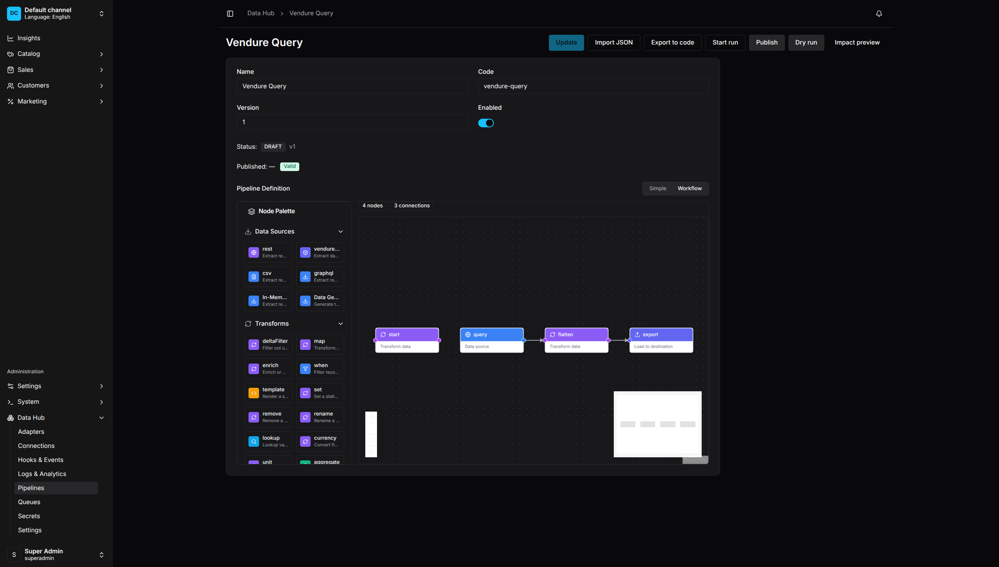
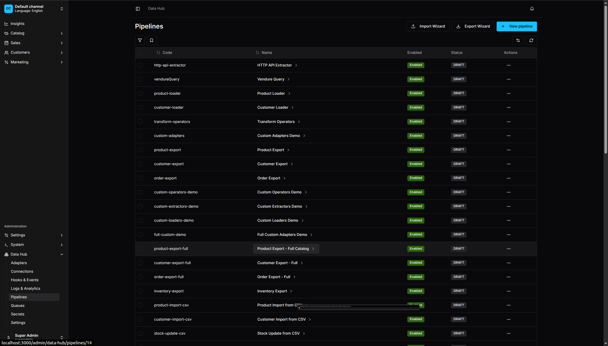
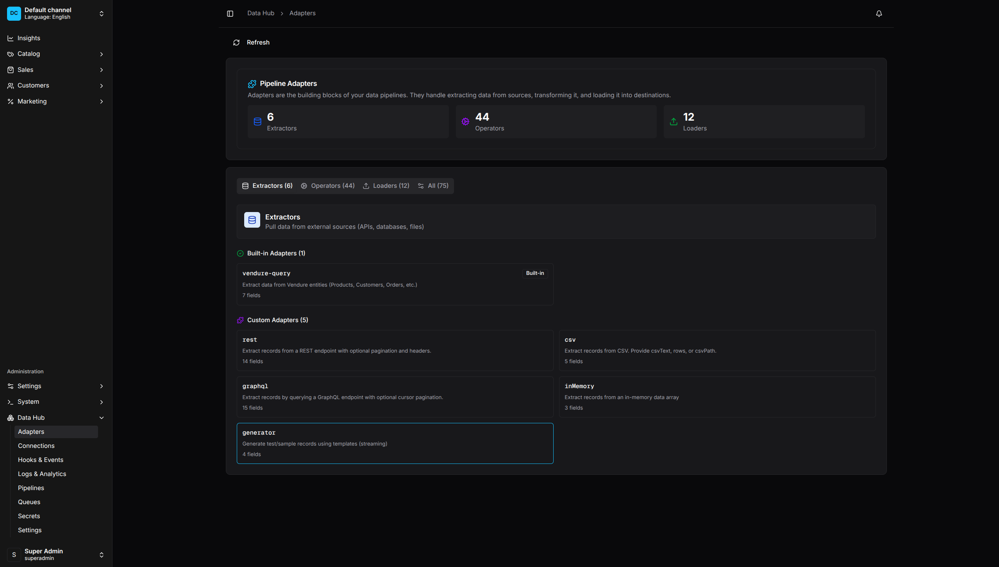
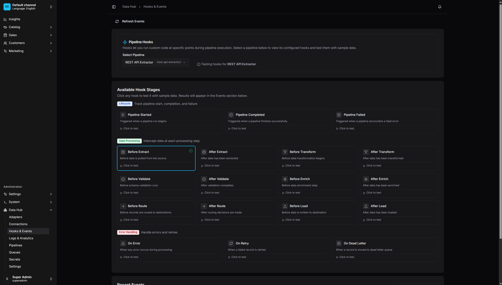
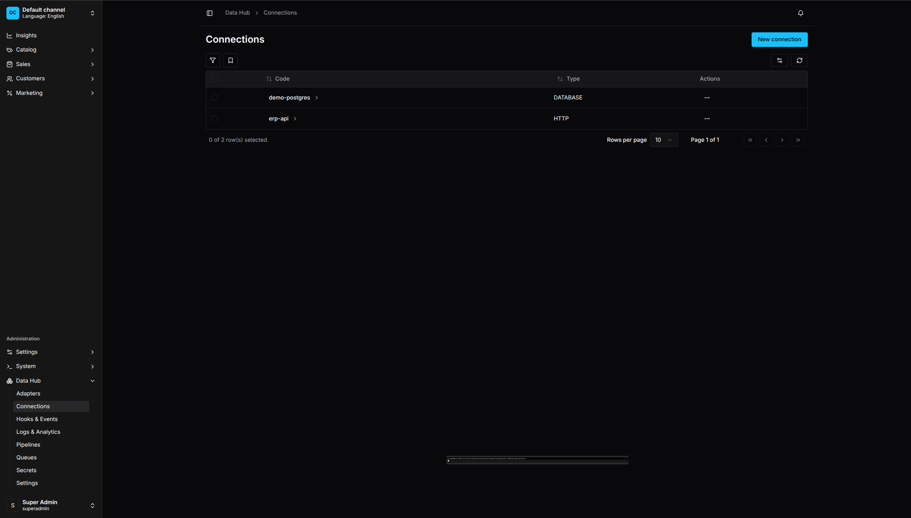
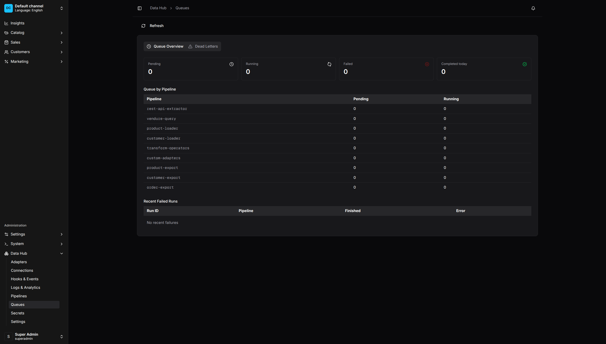
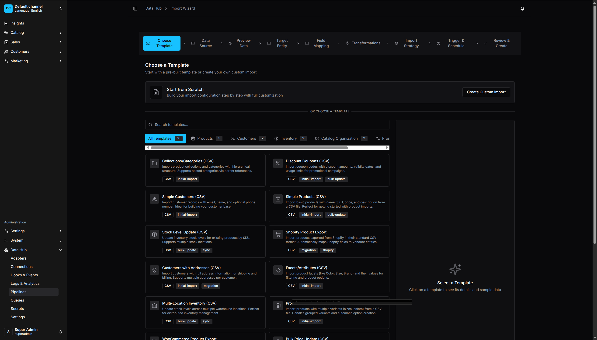
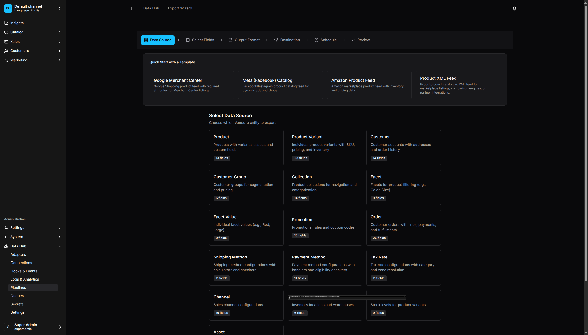

<p align="center">
  <a href="https://oronts.com">
    
  </a>
</p>

<h1 align="center">@oronts/vendure-data-hub-plugin</h1>

<p align="center">
  <strong>Enterprise ETL & Data Integration for Vendure E-commerce</strong>
</p>

<p align="center">
  <a href="https://github.com/oronts/vendure-data-hub-plugin/actions/workflows/ci.yml"></a>
  <a href="https://www.npmjs.com/package/@oronts/vendure-data-hub-plugin"></a>
  <a href="#license"></a>
  <a href="https://www.vendure.io/"></a>
</p>

<p align="center">
  <a href="#features">Features</a> •
  <a href="#installation">Installation</a> •
  <a href="#quick-start">Quick Start</a> •
  <a href="#extractors">Extractors</a> •
  <a href="#operators">Operators</a> •
  <a href="#loaders">Loaders</a> •
  <a href="#hooks">Hooks</a> •
  <a href="#documentation">Docs</a>
</p>

---

A full-featured ETL (Extract, Transform, Load) plugin for [Vendure](https://www.vendure.io/) e-commerce. Build data pipelines to import products, sync inventory, generate product feeds, index to search engines, and integrate with external systems.

## Features

- **Visual Pipeline Builder** - Drag-and-drop workflow editor with live validation
- **Code-First DSL** - TypeScript API for defining pipelines programmatically
- **9 Data Extractors** - HTTP/REST API, GraphQL, Vendure Query, File (CSV/JSON/XML/XLSX/NDJSON/TSV), Database (SQL), S3, FTP/SFTP, Webhook, CDC (Change Data Capture)
- **22 Loaders** - Products, Variants, Customers, Customer Groups, Collections, Facets, Facet Values, Promotions, Orders (notes, transitions, coupons), Shipping Methods, Stock Locations, Stock/Inventory, Assets, Tax Rates, Payment Methods, Channels, REST POST, GraphQL Mutation
- **61 Transform Operators** - String (12), Date (5), Numeric (9), Logic (4), JSON (4), Data (8), Enrichment (5), Aggregation (8), Validation (2), Script (1), File (3) - **includes HTTP Lookup with caching, circuit breaker, and rate limiting**
- **4 Feed Generators** - Google Merchant Center, Meta/Facebook Catalog, Amazon Seller Central, Custom Feed (CSV/JSON/XML/TSV)
- **7 Search & Integration Sinks** - Elasticsearch, OpenSearch, MeiliSearch, Algolia, Typesense, Queue Producer (RabbitMQ/SQS/Redis), Webhook
- **18 Hook Stages** - Interceptors and scripts to modify data at any pipeline stage
- **7 Connection Types** - HTTP/REST, S3, FTP, SFTP, Database (PostgreSQL/MySQL/SQLite/MSSQL/Oracle), Message Queue (RabbitMQ/SQS/Redis), Custom
- **6 Trigger Types** - Manual, Scheduled (cron), Webhook, Vendure Events, File Watch, **Message Queue Consumer**
- **Bi-directional Queue Support** - Consume from and produce to RabbitMQ (AMQP), Amazon SQS, Redis Streams
- **Horizontal Scaling** - Distributed locks via Redis or PostgreSQL for multi-instance deployments
- **Checkpoint Recovery** - Resume failed pipelines from last successful record
- **File Upload** - Drag-and-drop CSV/JSON file upload with automatic processing
- **Real-time Monitoring** - Logs, analytics, error tracking, and dead letter queue

## Screenshots

<p align="center">
  
  <br>
  <em>Visual Pipeline Editor - Drag-and-drop workflow builder</em>
</p>

<details>
<summary><strong>View More Screenshots</strong></summary>

<p align="center">
  
  <br>
  <em>Pipeline Management - Overview of all data pipelines</em>
</p>

<p align="center">
  
  <br>
  <em>Adapters Catalog - Extractors, Operators, and Loaders</em>
</p>

<p align="center">
  
  <br>
  <em>Logs & Analytics - Real-time monitoring and pipeline health</em>
</p>

<p align="center">
  
  <br>
  <em>Hooks & Events - Test hooks and view pipeline events</em>
</p>

<p align="center">
  
  <br>
  <em>Connections - Manage external system credentials</em>
</p>

<p align="center">
  
  <br>
  <em>Queues - Monitor pipeline execution and dead letters</em>
</p>

<p align="center">
  
  <br>
  <em>Import Wizard - Step-by-step guided data import with templates</em>
</p>

<p align="center">
  
  <br>
  <em>Export Wizard - Generate product feeds for Google, Facebook, Amazon</em>
</p>

</details>

## Installation

```bash
npm install @oronts/vendure-data-hub-plugin
```

## Quick Start

### Basic Setup

```typescript
// vendure-config.ts
import { VendureConfig } from '@vendure/core';
import { DataHubPlugin } from '@oronts/vendure-data-hub-plugin';

export const config: VendureConfig = {
    plugins: [
        DataHubPlugin.init({
            enabled: true,
        }),
    ],
};
```

The plugin adds a "Data Hub" section to your admin dashboard for creating and managing pipelines.

### Code-First Pipeline

Define pipelines in TypeScript:

```typescript
import { DataHubPlugin, createPipeline } from '@oronts/vendure-data-hub-plugin';

const productImport = createPipeline()
    .name('Product Import')
    .description('Import products from supplier API')
    .capabilities({ requires: ['UpdateCatalog'] })
    .trigger('start', { type: 'MANUAL' })
    .extract('fetch-products', {
        adapterCode: 'httpApi',
        url: 'https://api.supplier.com/products',
        method: 'GET',
        dataPath: 'data.products',
        pagination: {
            type: 'page',
            limit: 100,
            maxPages: 100,
        },
    })
    .transform('prepare', {
        operators: [
            { op: 'validateRequired', args: { fields: ['sku', 'name', 'price'] } },
            { op: 'trim', args: { path: 'name' } },
            { op: 'slugify', args: { source: 'name', target: 'slug' } },
            { op: 'currency', args: { source: 'price', target: 'priceInCents', decimals: 2 } },
            { op: 'set', args: { path: 'enabled', value: true } },
        ],
    })
    .load('upsert', {
        adapterCode: 'productUpsert',
        channel: '__default_channel__',
        strategy: 'UPSERT',
        conflictStrategy: 'SOURCE_WINS',
        slugField: 'slug',
    })
    .edge('start', 'fetch-products')
    .edge('fetch-products', 'prepare')
    .edge('prepare', 'upsert')
    .build();

export const config: VendureConfig = {
    plugins: [
        DataHubPlugin.init({
            pipelines: [{
                code: 'product-import',
                name: 'Product Import',
                definition: productImport,
            }],
        }),
    ],
};
```

## Configuration Options

| Option | Type | Default | Description |
|--------|------|---------|-------------|
| `enabled` | `boolean` | `true` | Enable or disable the plugin |
| `registerBuiltinAdapters` | `boolean` | `true` | Register built-in extractors, operators, loaders |
| `retentionDaysRuns` | `number` | `30` | Days to keep pipeline run history |
| `retentionDaysErrors` | `number` | `90` | Days to keep error records |
| `pipelines` | `CodeFirstPipeline[]` | `[]` | Define pipelines in code |
| `secrets` | `CodeFirstSecret[]` | `[]` | Define secrets in code |
| `connections` | `CodeFirstConnection[]` | `[]` | Define connections in code |
| `adapters` | `AdapterDefinition[]` | `[]` | Register custom adapters |
| `feedGenerators` | `CustomFeedGenerator[]` | `[]` | Register custom feed generators |
| `configPath` | `string` | - | Path to external configuration file |
| `enableDashboard` | `boolean` | `true` | Enable the admin dashboard UI |
| `runtime` | `RuntimeLimitsConfig` | - | Runtime limits (batch size, timeouts, etc.) |
| `security` | `SecurityConfig` | - | Security settings (SSRF protection, script sandboxing) |
| `debug` | `boolean` | `false` | Enable debug logging |

---

## Extractors

### Available Extractors

| Extractor | Code | Description |
|-----------|------|-------------|
| HTTP/REST API | `httpApi` | Fetch from REST APIs with pagination, auth (Bearer/Basic/HMAC), field mapping |
| GraphQL | `graphql` | Query GraphQL endpoints with cursor/offset/relay pagination, variables, auth |
| Vendure Query | `vendureQuery` | Query Vendure entities (Product, ProductVariant, Customer, Order, Collection, Facet, FacetValue, Promotion, Asset) |
| File | `file` | Parse CSV, JSON, XML, XLSX, NDJSON, TSV files with custom delimiters and encoding |
| Database | `database` | Query PostgreSQL, MySQL, MSSQL, SQLite with parameterized queries |
| S3 | `s3` | Read files from AWS S3 and S3-compatible storage (MinIO, DigitalOcean Spaces) |
| FTP/SFTP | `ftp` | Download files from FTP/SFTP servers with SSH key support |
| Webhook | `webhook` | Receive incoming webhook data with HMAC signature verification |
| CDC | `cdc` | Polling-based change data capture with checkpoint tracking |

### HTTP API Extractor

```typescript
.extract('fetch', {
    adapterCode: 'httpApi',
    url: 'https://api.example.com/products',
    method: 'GET',
    headers: { 'Accept': 'application/json' },
    dataPath: 'data.items',              // JSON path to records array
    connectionCode: 'my-api',            // Optional: use saved connection
    pagination: {
        type: 'page',
        limit: 100,
        maxPages: 10,
    },
})
```

### Vendure Query Extractor

```typescript
.extract('products', {
    adapterCode: 'vendureQuery',
    entity: 'PRODUCT',
    relations: 'variants,featuredAsset,facetValues',
    batchSize: 100,
})
```

---

## Operators

Transform operators organized by category. All operators take `args` with their configuration.

### Data Operators

| Operator | Description | Example |
|----------|-------------|---------|
| `set` | Set field to static value | `{ op: 'set', args: { path: 'enabled', value: true } }` |
| `copy` | Copy field value | `{ op: 'copy', args: { source: 'id', target: 'externalId' } }` |
| `rename` | Rename field | `{ op: 'rename', args: { from: 'product_name', to: 'name' } }` |
| `remove` | Delete field | `{ op: 'remove', args: { path: 'tempField' } }` |
| `map` | Remap multiple fields | `{ op: 'map', args: { mapping: { name: 'title', desc: 'body' } } }` |
| `template` | String templates | `{ op: 'template', args: { template: '${firstName} ${lastName}', target: 'fullName' } }` |
| `hash` | Generate hash | `{ op: 'hash', args: { source: 'data', target: 'checksum', algorithm: 'sha256' } }` |
| `uuid` | Generate UUID | `{ op: 'uuid', args: { target: 'id', version: 'v4' } }` |

### String Operators

| Operator | Description | Example |
|----------|-------------|---------|
| `trim` | Remove whitespace | `{ op: 'trim', args: { path: 'name' } }` |
| `uppercase` | Convert to uppercase | `{ op: 'uppercase', args: { path: 'sku' } }` |
| `lowercase` | Convert to lowercase | `{ op: 'lowercase', args: { path: 'email' } }` |
| `slugify` | URL-safe slug | `{ op: 'slugify', args: { source: 'name', target: 'slug' } }` |
| `split` | Split to array | `{ op: 'split', args: { source: 'tags', delimiter: ',', target: 'tagArray' } }` |
| `join` | Join array to string | `{ op: 'join', args: { source: 'parts', delimiter: '-', target: 'code' } }` |
| `concat` | Concatenate fields | `{ op: 'concat', args: { sources: ['first', 'last'], separator: ' ', target: 'name' } }` |
| `replace` | Replace text | `{ op: 'replace', args: { path: 'desc', search: '\n', replacement: '<br>', all: true } }` |
| `extractRegex` | Extract with regex | `{ op: 'extractRegex', args: { source: 'sku', pattern: '([A-Z]+)', target: 'prefix' } }` |
| `replaceRegex` | Regex replace | `{ op: 'replaceRegex', args: { path: 'text', pattern: '\\s+', replacement: ' ' } }` |
| `stripHtml` | Remove HTML tags | `{ op: 'stripHtml', args: { source: 'htmlContent', target: 'plainText' } }` |
| `truncate` | Truncate to length | `{ op: 'truncate', args: { source: 'description', length: 100, suffix: '...' } }` |

### Numeric Operators

| Operator | Description | Example |
|----------|-------------|---------|
| `math` | Math operations | `{ op: 'math', args: { operation: 'multiply', source: 'price', operand: 100, target: 'cents' } }` |
| `toNumber` | Parse to number | `{ op: 'toNumber', args: { source: 'priceStr', target: 'price', default: 0 } }` |
| `toString` | Convert to string | `{ op: 'toString', args: { source: 'id', target: 'idStr' } }` |
| `currency` | To minor units | `{ op: 'currency', args: { source: 'price', target: 'priceInCents', decimals: 2 } }` |
| `toCents` | Decimal to cents | `{ op: 'toCents', args: { source: 'price', target: 'priceInCents' } }` |
| `round` | Round number | `{ op: 'round', args: { source: 'value', decimals: 2 } }` |
| `unit` | Unit conversion | `{ op: 'unit', args: { source: 'weightKg', target: 'weightG', from: 'kg', to: 'g' } }` |
| `parseNumber` | Locale-aware parse | `{ op: 'parseNumber', args: { source: 'euro', target: 'num', locale: 'de-DE' } }` |
| `formatNumber` | Format number | `{ op: 'formatNumber', args: { source: 'price', target: 'display', style: 'currency', currency: 'USD' } }` |

Math operations: `add`, `subtract`, `multiply`, `divide`, `modulo`, `power`, `round`, `floor`, `ceil`, `abs`

### Date Operators

| Operator | Description | Example |
|----------|-------------|---------|
| `dateParse` | Parse date string | `{ op: 'dateParse', args: { source: 'dateStr', target: 'date', format: 'YYYY-MM-DD' } }` |
| `dateFormat` | Format to string | `{ op: 'dateFormat', args: { source: 'createdAt', target: 'display', format: 'DD/MM/YYYY HH:mm' } }` |
| `dateAdd` | Add/subtract time | `{ op: 'dateAdd', args: { source: 'orderDate', target: 'dueDate', amount: 7, unit: 'days' } }` |
| `dateDiff` | Calculate difference | `{ op: 'dateDiff', args: { startDate: 'orderDate', endDate: 'deliveredAt', unit: 'days', target: 'duration' } }` |
| `now` | Current timestamp | `{ op: 'now', args: { target: 'processedAt', format: 'ISO' } }` |

### JSON Operators

| Operator | Description | Example |
|----------|-------------|---------|
| `pick` | Keep only fields | `{ op: 'pick', args: { fields: ['id', 'name', 'sku'] } }` |
| `omit` | Remove fields | `{ op: 'omit', args: { fields: ['_internal', 'tempId'] } }` |
| `parseJson` | Parse JSON string | `{ op: 'parseJson', args: { source: 'metaJson', target: 'meta' } }` |
| `stringifyJson` | Stringify object | `{ op: 'stringifyJson', args: { source: 'data', target: 'dataJson' } }` |

### Conditional Operators

| Operator | Description | Example |
|----------|-------------|---------|
| `when` | Filter records | `{ op: 'when', args: { conditions: [{ field: 'stock', cmp: 'gt', value: 0 }], action: 'keep' } }` |
| `ifThenElse` | Conditional value | `{ op: 'ifThenElse', args: { condition: { field: 'type', cmp: 'eq', value: 'digital' }, thenValue: true, elseValue: false, target: 'isDigital' } }` |
| `switch` | Multi-case mapping | `{ op: 'switch', args: { source: 'code', cases: [{ value: 'A', result: 'Active' }], default: 'Unknown', target: 'status' } }` |

Comparison operators: `eq`, `ne`, `gt`, `gte`, `lt`, `lte`, `in`, `notIn`, `contains`, `notContains`, `startsWith`, `endsWith`, `regex`, `exists`, `isNull`

### Validation Operators

| Operator | Description | Example |
|----------|-------------|---------|
| `validateRequired` | Check required fields | `{ op: 'validateRequired', args: { fields: ['sku', 'name', 'price'] } }` |
| `validateFormat` | Regex validation | `{ op: 'validateFormat', args: { field: 'email', pattern: '^[^@]+@[^@]+\\.[^@]+$' } }` |

### Enrichment Operators

| Operator | Description | Example |
|----------|-------------|---------|
| `lookup` | Map value from dictionary | `{ op: 'lookup', args: { source: 'code', map: { 'A': 'Active' }, target: 'status' } }` |
| `enrich` | Add/default fields | `{ op: 'enrich', args: { defaults: { currency: 'USD' } } }` |
| `coalesce` | First non-null | `{ op: 'coalesce', args: { paths: ['name', 'title', 'label'], target: 'displayName' } }` |
| `default` | Default if null | `{ op: 'default', args: { path: 'stock', value: 0 } }` |
| `httpLookup` | Enrich from HTTP API | `{ op: 'httpLookup', args: { url: 'https://api.example.com/{{sku}}', target: 'externalData' } }` |

### Aggregation Operators

Aggregation operators include array manipulation, grouping, and data joining (8 operators).

| Operator | Description | Example |
|----------|-------------|---------|
| `aggregate` | Aggregate values | `{ op: 'aggregate', args: { op: 'sum', source: 'amount', target: 'total' } }` |
| `count` | Count elements | `{ op: 'count', args: { source: 'items', target: 'itemCount' } }` |
| `unique` | Remove duplicates | `{ op: 'unique', args: { source: 'items', by: 'id', target: 'uniqueItems' } }` |
| `flatten` | Flatten nested arrays | `{ op: 'flatten', args: { source: 'nested', target: 'flat', depth: 1 } }` |
| `first` | Get first element | `{ op: 'first', args: { source: 'items', target: 'firstItem' } }` |
| `last` | Get last element | `{ op: 'last', args: { source: 'items', target: 'lastItem' } }` |
| `expand` | Explode to records | `{ op: 'expand', args: { path: 'variants' } }` |
| `multiJoin` | Join datasets by key | `{ op: 'multiJoin', args: { leftKey: 'customerId', rightKey: 'id', rightDataPath: 'orders', type: 'LEFT' } }` |

### Advanced Operators

| Operator | Description | Example |
|----------|-------------|---------|
| `deltaFilter` | Change detection | `{ op: 'deltaFilter', args: { idPath: 'sku', includePaths: ['price', 'stock'] } }` |
| `script` | Custom JavaScript | See Script Operator section below |

### Script Operator

Execute custom JavaScript for complex transformations:

```typescript
// Single record mode
.transform('enrich', {
    operators: [{
        op: 'script',
        args: {
            code: `
                const margin = (record.price - record.cost) / record.price * 100;
                return { ...record, margin: Math.round(margin * 100) / 100 };
            `,
        },
    }],
})

// Batch mode - access all records
.transform('rank', {
    operators: [{
        op: 'script',
        args: {
            batch: true,
            code: `
                const sorted = records.sort((a, b) => b.sales - a.sales);
                return sorted.map((r, i) => ({ ...r, rank: i + 1 }));
            `,
        },
    }],
})

// Filter mode - return null to exclude
.transform('filter', {
    operators: [{
        op: 'script',
        args: {
            code: `return record.stock > 0 ? record : null;`,
        },
    }],
})
```

---

## Loaders

### Available Loaders

| Loader | Adapter Code | Description |
|--------|--------------|-------------|
| Product Loader | `productUpsert` | Create/update products with variants, prices, tax, and stock |
| Variant Loader | `variantUpsert` | Update product variants by SKU with multi-currency prices |
| Customer Loader | `customerUpsert` | Create/update customers with addresses and group memberships |
| Customer Group Loader | `customerGroupUpsert` | Create/update customer groups by name; assign customers by email |
| Collection Loader | `collectionUpsert` | Create/update collections with parent relationships |
| Promotion Loader | `promotionUpsert` | Create/update promotions with conditions and actions |
| Order Note Loader | `orderNote` | Attach notes to orders by code or id |
| Order Transition Loader | `orderTransition` | Transition orders to new states |
| Stock Adjust Loader | `stockAdjust` | Adjust inventory levels by SKU and stock location map |
| Inventory Adjust Loader | `inventoryAdjust` | Adjust stock levels for product variants by SKU with location targeting |
| Asset Attach Loader | `assetAttach` | Attach existing assets to products/collections |
| Apply Coupon Loader | `applyCoupon` | Apply coupon codes to orders |
| Tax Rate Loader | `taxRateUpsert` | Create/update tax rates by name with category and zone |
| Payment Method Loader | `paymentMethodUpsert` | Create/update payment methods with handler and checker |
| Channel Loader | `channelUpsert` | Create/update channels with currencies, languages, and zones |
| Shipping Method Loader | `shippingMethodUpsert` | Create/update shipping methods with calculator and checker |
| Stock Location Loader | `stockLocationUpsert` | Create/update stock locations and warehouses |
| Facet Loader | `facetUpsert` | Create/update facets with translations |
| Facet Value Loader | `facetValueUpsert` | Create/update facet values with translations |
| GraphQL Mutation Loader | `graphqlMutation` | Execute arbitrary GraphQL mutations against Vendure |
| Asset Import Loader | `assetImport` | Import assets from URLs or file paths |
| REST POST Loader | `restPost` | POST/PUT records to external REST endpoints |

### Product Loader

```typescript
.load('import-products', {
    adapterCode: 'productUpsert',
    channel: '__default_channel__',
    strategy: 'UPSERT',                  // CREATE, UPDATE, UPSERT
    conflictStrategy: 'SOURCE_WINS',     // SOURCE_WINS, VENDURE_WINS, MERGE, MANUAL_QUEUE
    nameField: 'name',
    slugField: 'slug',
    skuField: 'sku',
    priceField: 'price',
})
```

### Inventory Loader

```typescript
.load('update-stock', {
    adapterCode: 'stockAdjust',
    skuField: 'sku',
    stockByLocationField: 'stockByLocation',  // Map of location code -> quantity
    absolute: true,                           // Set absolute value (false = delta)
})
```

### Customer Loader

```typescript
.load('import-customers', {
    adapterCode: 'customerUpsert',
    emailField: 'email',
    firstNameField: 'firstName',
    lastNameField: 'lastName',
    phoneNumberField: 'phone',
    addressesField: 'addresses',
    groupsField: 'groupCodes',
})
```

### Asset Loader

```typescript
.load('import-assets', {
    adapterCode: 'assetAttach',
    entity: 'PRODUCT',
    slugField: 'productSlug',
    assetIdField: 'assetId',
    channel: '__default_channel__',
})
```

---

## Hooks

Hooks let you run code at 18 different pipeline stages. Two types:
- **Interceptors**: Modify the record array (return modified records)
- **Observation hooks**: Side effects only (webhooks, events, logging)

### Hook Stages

**Data Processing:**
- `BEFORE_EXTRACT`, `AFTER_EXTRACT`
- `BEFORE_TRANSFORM`, `AFTER_TRANSFORM`
- `BEFORE_VALIDATE`, `AFTER_VALIDATE`
- `BEFORE_ENRICH`, `AFTER_ENRICH`
- `BEFORE_ROUTE`, `AFTER_ROUTE`
- `BEFORE_LOAD`, `AFTER_LOAD`

**Pipeline Lifecycle:**
- `PIPELINE_STARTED`, `PIPELINE_COMPLETED`, `PIPELINE_FAILED`
- `ON_ERROR`, `ON_RETRY`, `ON_DEAD_LETTER`

### Hook Types

| Type | Purpose | Can Modify Records |
|------|---------|-------------------|
| `INTERCEPTOR` | Inline JavaScript code | Yes |
| `SCRIPT` | Pre-registered functions | Yes |
| `WEBHOOK` | HTTP POST notification | No |
| `EMIT` | Vendure domain event | No |
| `TRIGGER_PIPELINE` | Start another pipeline | No |
| `LOG` | Log message to pipeline logs | No |

### Interceptor Hooks

Inline JavaScript that can modify records:

```typescript
const pipeline = createPipeline()
    .name('With Interceptors')
    .hooks({
        AFTER_EXTRACT: [{
            type: 'INTERCEPTOR',
            name: 'Add metadata',
            code: `
                return records.map(r => ({
                    ...r,
                    extractedAt: new Date().toISOString(),
                    source: 'api',
                }));
            `,
        }],
        BEFORE_TRANSFORM: [{
            type: 'INTERCEPTOR',
            name: 'Filter low stock',
            code: `return records.filter(r => r.stock > 0);`,
            failOnError: true,
        }],
        BEFORE_LOAD: [{
            type: 'INTERCEPTOR',
            name: 'Final validation',
            code: `
                return records.filter(r => {
                    if (!r.sku || !r.name) {
                        console.warn('Skipping invalid record:', r.id);
                        return false;
                    }
                    return true;
                });
            `,
        }],
    })
    // ... steps
    .build();
```

### Script Hooks

Reference pre-registered functions (type-safe, reusable):

```typescript
// Register scripts at startup
hookService.registerScript('addCustomerSegment', async (records, context, args) => {
    const threshold = args?.spendThreshold || 1000;
    return records.map(r => ({
        ...r,
        segment: r.totalSpent > threshold ? 'premium' : 'standard',
    }));
});

// Use in pipeline
const pipeline = createPipeline()
    .hooks({
        AFTER_TRANSFORM: [{
            type: 'SCRIPT',
            scriptName: 'addCustomerSegment',
            args: { spendThreshold: 5000 },
        }],
    })
    .build();
```

### Webhook Hooks

Notify external systems:

```typescript
.hooks({
    PIPELINE_COMPLETED: [{
        type: 'WEBHOOK',
        url: 'https://slack.webhook.example.com/notify',
        headers: { 'Content-Type': 'application/json' },
        secret: 'webhook-signing-key',
        signatureHeader: 'X-Signature',
        retryConfig: {
            maxAttempts: 5,
            initialDelayMs: 1000,
            maxDelayMs: 60000,
            backoffMultiplier: 2,
        },
    }],
    PIPELINE_FAILED: [{
        type: 'WEBHOOK',
        url: 'https://pagerduty.example.com/alert',
    }],
})
```

### Trigger Pipeline Hooks

Chain pipelines together:

```typescript
.hooks({
    AFTER_LOAD: [{
        type: 'TRIGGER_PIPELINE',
        pipelineCode: 'reindex-search',  // Runs with loaded records as seed
    }],
})
```

---

## Product Feeds

Generate feeds for advertising platforms.

### Google Merchant Center

```typescript
.feed('google-feed', {
    adapterCode: 'googleMerchant',
    format: 'xml',                       // xml or tsv
    targetCountry: 'US',
    contentLanguage: 'en',
    currency: 'USD',
    storeUrl: 'https://mystore.com',
    storeName: 'My Store',
    includeOutOfStock: false,
    outputPath: '/feeds/google-shopping.xml',
})
```

### Meta/Facebook Catalog

```typescript
.feed('meta-catalog', {
    adapterCode: 'metaCatalog',
    format: 'csv',
    currency: 'USD',
    brandField: 'customFields.brand',
    categoryField: 'customFields.googleCategory',
    includeVariants: true,
    outputPath: '/feeds/facebook-catalog.csv',
})
```

### Custom Feed

```typescript
.feed('custom-feed', {
    adapterCode: 'customFeed',
    format: 'json',                      // xml, csv, json, tsv
    rootElement: 'products',
    itemElement: 'product',
    fieldMapping: {
        product_id: 'id',
        product_name: 'name',
        product_price: 'priceFormatted',
    },
    outputPath: '/feeds/custom-products.json',
})
```

---

## Search Engine Sync

Index products to search engines.

### Elasticsearch

```typescript
.sink('elasticsearch', {
    adapterCode: 'elasticsearch',
    node: 'http://localhost:9200',
    indexName: 'products',
    idField: 'id',
    batchSize: 500,
    refresh: true,
})
```

### MeiliSearch

```typescript
.sink('meilisearch', {
    adapterCode: 'meilisearch',
    host: 'http://localhost:7700',
    apiKeySecretCode: 'meilisearch-key',
    indexName: 'products',
    primaryKey: 'id',
    searchableFields: ['name', 'description', 'sku'],
    filterableFields: ['category', 'brand', 'price'],
    sortableFields: ['price', 'createdAt'],
})
```

### Algolia

```typescript
.sink('algolia', {
    adapterCode: 'algolia',
    appId: 'your-app-id',
    apiKeySecretCode: 'algolia-admin-key',
    indexName: 'products',
    idField: 'objectID',
})
```

### Typesense

```typescript
.sink('typesense', {
    adapterCode: 'typesense',
    host: 'localhost',
    port: 8108,
    protocol: 'http',
    apiKeySecretCode: 'typesense-key',
    collectionName: 'products',
    idField: 'id',
})
```

---

## Scheduling & Triggers

### Manual Trigger

```typescript
.trigger('start', { type: 'MANUAL' })
```

### Cron Schedule

```typescript
.trigger('schedule', {
    type: 'SCHEDULE',
    cron: '0 2 * * *',                   // Daily at 2 AM
    timezone: 'America/New_York',
})
```

Common patterns:
- `0 * * * *` - Every hour
- `0 0 * * *` - Daily at midnight
- `0 2 * * *` - Daily at 2 AM
- `0 0 * * 0` - Weekly on Sunday
- `0 0 1 * *` - Monthly on the 1st

### Webhook Trigger

```typescript
.trigger('webhook', {
    type: 'WEBHOOK',
    authentication: 'API_KEY',      // 'NONE' | 'API_KEY' | 'HMAC' | 'BASIC' | 'JWT'
    apiKeySecretCode: 'my-api-key', // Secret code storing the API key
    apiKeyHeaderName: 'x-api-key',  // Header name for API key (default: x-api-key)
    rateLimit: 100,                 // Requests per minute per IP (0 = unlimited)
    requireIdempotencyKey: true,    // Require X-Idempotency-Key header
})
```

**Authentication Types:**

| Type | Description | Configuration |
|------|-------------|---------------|
| `NONE` | No authentication (not recommended) | - |
| `API_KEY` | API key in header | `apiKeySecretCode`, `apiKeyHeaderName`, `apiKeyPrefix` |
| `HMAC` | HMAC-SHA256 signature | `secretCode`, `hmacHeaderName`, `hmacAlgorithm` |
| `BASIC` | HTTP Basic Auth | `basicSecretCode` (stores `username:password`) |
| `JWT` | JWT Bearer token | `jwtSecretCode`, `jwtHeaderName` |

**Example - HMAC Authentication:**
```typescript
.trigger('webhook', {
    type: 'WEBHOOK',
    authentication: 'HMAC',
    secretCode: 'hmac-secret',        // Secret code storing HMAC key
    hmacHeaderName: 'x-signature',    // Header name (default: x-datahub-signature)
    hmacAlgorithm: 'SHA256',          // SHA256 or SHA512
})
```

**Endpoint:** `POST /data-hub/webhook/{pipeline-code}`

**Security Features:**
- Timing-safe comparison for all credential checks
- Configurable rate limiting per pipeline
- IP-based rate limiting with sliding window
- JWT expiration validation

### Event Trigger

```typescript
.trigger('on-order', {
    type: 'EVENT',
    event: 'OrderPlacedEvent',
    filter: { state: 'ArrangingPayment' },
})
```

---

## Admin UI Features

The plugin includes a full-featured admin dashboard:

### Pipeline Editor
- **Simple Mode**: JSON text editor with syntax highlighting
- **Visual Mode**: Drag-and-drop workflow builder with node palette
- Live validation with error highlighting
- Step tester for testing individual steps

### Dry Run
- Execute pipeline without persisting changes
- View record diffs (before/after transformations)
- Metrics summary (processed, succeeded, failed, skipped)
- Step-by-step execution details

### Monitoring
- Real-time execution logs with filtering
- Analytics dashboard with metrics
- Per-pipeline health stats
- Error rate tracking

### Queue Management
- View pending, running, and failed jobs
- Dead letter queue for quarantined records
- Retry failed records with payload patching

### Hooks Testing
- Test any of the 18 hook stages
- View recent events
- Hook configuration viewer

---

## Secrets & Connections

### Code-First Secrets

```typescript
DataHubPlugin.init({
    secrets: [
        { code: 'api-key', provider: 'ENV', value: 'SUPPLIER_API_KEY' },
        { code: 'ftp-pass', provider: 'INLINE', value: 'secret123' },
    ],
})
```

### Code-First Connections

Supported connection types: `http`, `postgres`, `mysql`, `s3`, `ftp`, `sftp`

```typescript
DataHubPlugin.init({
    connections: [
        {
            code: 'supplier-api',
            type: 'http',
            name: 'Supplier REST API',
            settings: {
                baseUrl: 'https://api.supplier.com',
                timeout: 30000,
                auth: {
                    type: 'bearer',
                    secretCode: 'supplier-api-key',
                },
            },
        },
        {
            code: 'supplier-db',
            type: 'postgres',
            name: 'Supplier Database',
            settings: {
                host: '${DB_HOST}',
                port: 5432,
                database: 'supplier',
                username: '${DB_USER}',
                passwordSecretCode: 'db-password',
                ssl: true,
            },
        },
        {
            code: 'product-bucket',
            type: 's3',
            name: 'Product Feed Bucket',
            settings: {
                bucket: 'product-feeds',
                region: 'us-east-1',
                accessKeyIdSecretCode: 'aws-access-key',
                secretAccessKeySecretCode: 'aws-secret-key',
            },
        },
        {
            code: 'sftp-server',
            type: 'sftp',
            name: 'Supplier SFTP',
            settings: {
                host: 'sftp.supplier.com',
                port: 22,
                username: '${SFTP_USER}',
                privateKeySecretCode: 'sftp-key',
            },
        },
    ],
})
```

---

## Custom Adapters

### Custom Operator

```typescript
import { SingleRecordOperator, JsonObject, AdapterOperatorHelpers } from '@oronts/vendure-data-hub-plugin';

interface CurrencyConvertConfig {
    field: string;
    from: string;
    to: string;
    targetField?: string;
}

const currencyConvert: SingleRecordOperator<CurrencyConvertConfig> = {
    code: 'currencyConvert',
    type: 'OPERATOR',
    name: 'Currency Convert',
    description: 'Convert between currencies',
    category: 'CONVERSION',
    pure: true,
    schema: {
        fields: [
            { key: 'field', type: 'string', label: 'Price Field', required: true },
            { key: 'from', type: 'string', label: 'From Currency', required: true },
            { key: 'to', type: 'string', label: 'To Currency', required: true },
            { key: 'targetField', type: 'string', label: 'Target Field', required: false },
        ],
    },
    applyOne(record: JsonObject, config: CurrencyConvertConfig, helpers: AdapterOperatorHelpers): JsonObject | null {
        const rate = getExchangeRate(config.from, config.to);
        const value = helpers.get(record, config.field) as number;
        const converted = value * rate;
        helpers.set(record, config.targetField || config.field, converted);
        return record;
    },
};

DataHubPlugin.init({
    adapters: [currencyConvert],
})
```

### Custom Extractor

```typescript
import { ExtractorAdapter, ExtractContext, RecordEnvelope } from '@oronts/vendure-data-hub-plugin';

interface MyExtractorConfig {
    endpoint: string;
}

const myExtractor: ExtractorAdapter<MyExtractorConfig> = {
    code: 'myExtractor',
    type: 'EXTRACTOR',
    name: 'My Custom Source',
    description: 'Fetch data from custom API',
    schema: {
        fields: [
            { key: 'endpoint', type: 'string', label: 'API Endpoint', required: true },
        ],
    },
    async *extract(context: ExtractContext, config: MyExtractorConfig): AsyncGenerator<RecordEnvelope, void, undefined> {
        const response = await fetch(config.endpoint);
        const data = await response.json();
        for (const item of data.items) {
            yield { data: item };
        }
    },
};
```

### Custom Loader

```typescript
import { LoaderAdapter, LoadContext, JsonObject, LoadResult } from '@oronts/vendure-data-hub-plugin';

interface WebhookNotifyConfig {
    endpoint: string;
    batchSize?: number;
}

const webhookNotify: LoaderAdapter<WebhookNotifyConfig> = {
    code: 'webhookNotify',
    type: 'LOADER',
    name: 'Webhook Notify',
    description: 'Send records to webhook endpoint',
    schema: {
        fields: [
            { key: 'endpoint', type: 'string', label: 'Webhook URL', required: true },
            { key: 'batchSize', type: 'number', label: 'Batch Size', required: false },
        ],
    },
    async load(context: LoadContext, config: WebhookNotifyConfig, records: readonly JsonObject[]): Promise<LoadResult> {
        await fetch(config.endpoint, {
            method: 'POST',
            headers: { 'Content-Type': 'application/json' },
            body: JSON.stringify(records),
        });
        return { succeeded: records.length, failed: 0, errors: [] };
    },
};
```

---

## Permissions

| Permission | Description |
|------------|-------------|
| `CreateDataHubPipeline` | Create pipelines |
| `ReadDataHubPipeline` | View pipelines |
| `UpdateDataHubPipeline` | Modify pipelines |
| `DeleteDataHubPipeline` | Delete pipelines |
| `RunDataHubPipeline` | Execute pipelines |
| `PublishDataHubPipeline` | Publish pipeline versions |
| `ReviewDataHubPipeline` | Review/approve pipelines |
| `CreateDataHubSecret` | Create secrets |
| `ReadDataHubSecret` | View secrets (values masked) |
| `UpdateDataHubSecret` | Modify secrets |
| `DeleteDataHubSecret` | Delete secrets |
| `ManageDataHubConnections` | Manage connections |
| `ManageDataHubAdapters` | Configure adapters |
| `ViewDataHubRuns` | View execution history |
| `RetryDataHubRecord` | Retry failed records |
| `ViewDataHubQuarantine` | View dead letter queue |
| `EditDataHubQuarantine` | Manage quarantined records |
| `ReplayDataHubRecord` | Replay processed records |
| `UpdateDataHubSettings` | Modify plugin settings |
| `ViewDataHubAnalytics` | View analytics dashboard |
| `ManageDataHubWebhooks` | Configure webhook endpoints |
| `ManageDataHubDestinations` | Manage export destinations |
| `ManageDataHubFeeds` | Manage product feeds |
| `ViewDataHubEntitySchemas` | View entity schemas |
| `SubscribeDataHubEvents` | Subscribe to pipeline events |
| `ManageDataHubFiles` | Upload and manage files |
| `ReadDataHubFiles` | Read uploaded files |

---

## Pipeline Capabilities

Require specific Vendure permissions to run a pipeline:

```typescript
const importPipeline = createPipeline()
    .capabilities({ requires: ['UpdateCatalog', 'UpdateStock'] })
    // ...

const exportPipeline = createPipeline()
    .capabilities({ requires: ['ReadCustomer', 'ReadOrder'] })
    // ...
```

---

## Error Handling

### Pipeline-Level

```typescript
const pipeline = createPipeline()
    .context({
        errorHandling: {
            strategy: 'continue',        // continue, stop, dead-letter
            maxRetries: 3,
            retryDelayMs: 1000,
        },
    })
    .build();
```

### Step-Level

```typescript
.load('import', {
    adapterCode: 'productUpsert',
    errorHandling: {
        mode: 'queue',                   // stop, continue, queue, dead-letter
        retryAttempts: 3,
        retryDelayMs: 1000,
    },
})
```

---

## Requirements

| Requirement | Version |
|-------------|---------|
| Vendure | ^3.0.0 |
| Node.js | >=18.0.0 |

## Documentation

- [Getting Started](./docs/getting-started/README.md)
- [User Guide](./docs/user-guide/README.md)
- [Developer Guide](./docs/developer-guide/README.md)
- [API Reference](./docs/reference/README.md)
- [Deployment](./docs/deployment/README.md)

---

## License

**Commercial plugin** - Free for non-commercial use.

### Free Use
- Personal projects, learning, evaluation
- Open-source non-commercial projects

### Commercial License Required
- Business/commercial use
- E-commerce stores generating revenue
- Client projects, agency work
- SaaS platforms

Contact **office@oronts.com** for licensing.

---

## Consulting & Custom Development

<p align="center">
  <a href="https://oronts.com">
    
  </a>
</p>

**Oronts** provides custom development and integration services:

- Data Hub customization and integrations
- Full-stack Vendure development
- E-commerce platform implementation
- AI-powered automation

**Contact:** office@oronts.com | [oronts.com](https://oronts.com)

---

**Author:** [Oronts](https://oronts.com) - AI-powered automation, e-commerce platforms, cloud infrastructure.

**Contributors:** Refaat Al Ktifan (Refaat@alktifan.com)
