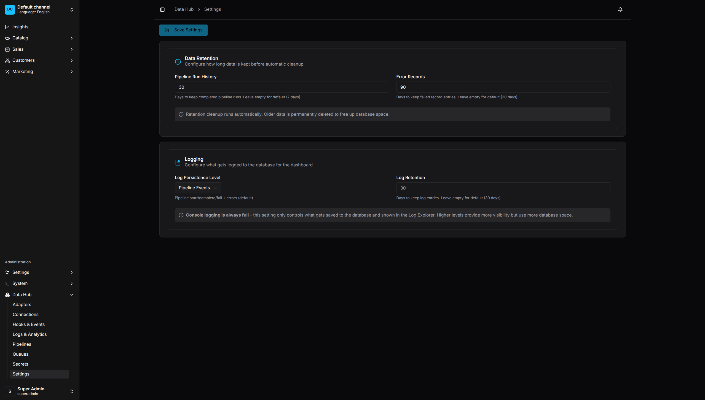

# Configuration Options

Complete reference for all Data Hub plugin configuration options.

<p align="center">
  
  <br>
  <em>Settings UI - Configure data retention and logging options</em>
</p>

## Plugin Options

```typescript
DataHubPlugin.init({
    // Core settings
    enabled: true,
    registerBuiltinAdapters: true,
    debug: false,
    enableDashboard: true,

    // Retention
    retentionDaysRuns: 30,
    retentionDaysErrors: 90,

    // Code-first configuration
    pipelines: [],
    secrets: [],
    connections: [],
    adapters: [],
    feedGenerators: [],
    configPath: undefined,

    // Runtime configuration
    runtime: {
        batch: { size: 50, bulkSize: 100 },
        http: { timeoutMs: 30000, maxRetries: 3 },
    },

    // Security configuration
    security: {
        ssrf: { /* SSRF protection settings */ },
        script: { enabled: true },
    },
})
```

## Option Reference

### enabled

| | |
|---|---|
| Type | `boolean` |
| Default | `true` |
| Description | Enable or disable the plugin entirely |

```typescript
DataHubPlugin.init({
    enabled: process.env.DATAHUB_ENABLED !== 'false',
})
```

### registerBuiltinAdapters

| | |
|---|---|
| Type | `boolean` |
| Default | `true` |
| Description | Register built-in extractors, operators, and loaders |

Set to `false` if you want to register only custom adapters.

### debug

| | |
|---|---|
| Type | `boolean` |
| Default | `false` |
| Description | Enable detailed debug logging |

```typescript
DataHubPlugin.init({
    debug: process.env.NODE_ENV !== 'production',
})
```

### enableDashboard

| | |
|---|---|
| Type | `boolean` |
| Default | `true` |
| Description | Enable or disable the Data Hub dashboard UI |

```typescript
DataHubPlugin.init({
    enableDashboard: true,
})
```

### retentionDaysRuns

| | |
|---|---|
| Type | `number` |
| Default | `30` |
| Description | Days to keep pipeline run history |

Old runs are deleted automatically by the retention job.

### retentionDaysErrors

| | |
|---|---|
| Type | `number` |
| Default | `90` |
| Description | Days to keep error records |

Quarantined records older than this are deleted.

### pipelines

| | |
|---|---|
| Type | `CodeFirstPipeline[]` |
| Default | `[]` |
| Description | Code-first pipeline definitions |

```typescript
interface CodeFirstPipeline {
    code: string;
    name: string;
    description?: string;
    enabled?: boolean;
    definition: PipelineDefinition;
    tags?: string[];
}
```

### secrets

| | |
|---|---|
| Type | `CodeFirstSecret[]` |
| Default | `[]` |
| Description | Code-first secret definitions |

```typescript
interface CodeFirstSecret {
    code: string;
    provider: 'inline' | 'env';
    value: string;
    metadata?: Record<string, any>;
}
```

### connections

| | |
|---|---|
| Type | `CodeFirstConnection[]` |
| Default | `[]` |
| Description | Code-first connection definitions |

```typescript
interface CodeFirstConnection {
    code: string;           // Unique connection identifier
    type: string;           // Connection type (e.g., 'postgres', 'mysql', 'rest', 's3')
    name: string;           // Human-readable name
    settings: JsonObject;   // Connection settings - supports env var references like ${DB_HOST}
}
```

### adapters

| | |
|---|---|
| Type | `AdapterDefinition[]` |
| Default | `[]` |
| Description | Custom adapter registrations |

```typescript
interface AdapterDefinition {
    code: string;
    type: 'extractor' | 'operator' | 'loader' | 'feed';
    name: string;
    handler: any;
    schema?: object;
}
```

Example:

```typescript
DataHubPlugin.init({
    adapters: [
        {
            code: 'my-extractor',
            type: 'extractor',
            name: 'My Custom Extractor',
            handler: MyExtractorClass,
        },
        {
            code: 'currency-convert',
            type: 'operator',
            name: 'Currency Converter',
            handler: currencyConvertOperator,
        },
    ],
})
```

See [Extending the Plugin](../developer-guide/extending/README.md) for detailed documentation on creating custom adapters.

### feedGenerators

| | |
|---|---|
| Type | `CustomFeedGenerator[]` |
| Default | `[]` |
| Description | Custom feed generator registrations |

```typescript
DataHubPlugin.init({
    feedGenerators: [
        myCustomFeedGenerator,
    ],
})
```

### runtime

| | |
|---|---|
| Type | `RuntimeLimitsConfig` |
| Default | See below |
| Description | Runtime configuration for batch processing, HTTP, circuit breaker, etc. |

```typescript
interface RuntimeLimitsConfig {
    batch?: {
        size?: number;              // Default batch size (default: 50)
        bulkSize?: number;          // Bulk operation size (default: 100)
        maxInFlight?: number;       // Max concurrent operations (default: 5)
        rateLimitRps?: number;      // Requests per second (default: 10)
    };
    http?: {
        timeoutMs?: number;         // Request timeout (default: 30000)
        maxRetries?: number;        // Max retry attempts (default: 3)
        retryDelayMs?: number;      // Initial retry delay (default: 1000)
        retryMaxDelayMs?: number;   // Max retry delay (default: 30000)
        exponentialBackoff?: boolean;  // Enable exponential backoff (default: true)
        backoffMultiplier?: number; // Backoff multiplier (default: 2)
    };
    circuitBreaker?: {
        enabled?: boolean;          // Enable circuit breaker (default: true)
        failureThreshold?: number;  // Failures before opening (default: 5)
        successThreshold?: number;  // Successes to close (default: 3)
        resetTimeoutMs?: number;    // Time before reset attempt (default: 30000)
    };
    connectionPool?: {
        min?: number;               // Min connections (default: 1)
        max?: number;               // Max connections (default: 10)
        idleTimeoutMs?: number;     // Idle timeout (default: 30000)
    };
    pagination?: {
        maxPages?: number;          // Max pages to fetch (default: 100)
        pageSize?: number;          // Default page size (default: 100)
        databasePageSize?: number;  // Database page size (default: 1000)
    };
    scheduler?: {
        checkIntervalMs?: number;   // Cron check interval (default: 30000)
        refreshIntervalMs?: number; // Cache refresh interval (default: 60000)
    };
}
```

Example:

```typescript
DataHubPlugin.init({
    runtime: {
        batch: { size: 100, maxInFlight: 10 },
        http: { timeoutMs: 60000, maxRetries: 5 },
        circuitBreaker: { failureThreshold: 10 },
    },
})
```

### security

| | |
|---|---|
| Type | `SecurityConfig` |
| Default | See below |
| Description | Security configuration for SSRF protection and script execution |

```typescript
interface SecurityConfig {
    ssrf?: UrlSecurityConfig;     // SSRF protection settings
    script?: ScriptSecurityConfig; // Script operator security settings
}

interface ScriptSecurityConfig {
    enabled?: boolean;            // Enable script operators (default: true)
    validation?: {                // Code validation settings
        maxExpressionLength?: number;
        // ... other validation options
    };
    maxCacheSize?: number;        // Max cached expressions (default: 1000)
    defaultTimeoutMs?: number;    // Script timeout (default: 5000)
    enableCache?: boolean;        // Enable expression caching (default: true)
}
```

Example:

```typescript
DataHubPlugin.init({
    security: {
        script: {
            enabled: true,
            defaultTimeoutMs: 10000,
        },
    },
})
```

### configPath

| | |
|---|---|
| Type | `string` |
| Default | `undefined` |
| Description | Path to external config file |

Load configuration from YAML or JSON file:

```typescript
DataHubPlugin.init({
    configPath: './config/data-hub.yaml',
})
```

## Environment Variables

Use environment variables in configurations:

### In Secrets

```typescript
secrets: [
    { code: 'api-key', provider: 'env', value: 'MY_API_KEY' },
]
```

### In Connections

Use `${VAR}` syntax:

```typescript
connections: [
    {
        code: 'db',
        type: 'postgres',
        settings: {
            host: '${DB_HOST}',
            password: '${DB_PASSWORD}',
        },
    },
]
```

## External Config File

### YAML Format

```yaml
# data-hub.yaml
secrets:
  - code: supplier-api
    provider: env
    value: SUPPLIER_API_KEY

connections:
  - code: erp-db
    type: postgres
    name: ERP Database
    settings:
      host: ${ERP_DB_HOST}
      port: 5432
      database: erp
      username: ${ERP_DB_USER}
      password: ${ERP_DB_PASSWORD}

pipelines:
  - code: product-sync
    name: Product Sync
    enabled: true
    definition:
      version: 1
      steps:
        - key: trigger
          type: trigger
          config:
            type: schedule
            cron: "0 2 * * *"
```

### JSON Format

```json
{
    "secrets": [
        { "code": "api-key", "provider": "env", "value": "API_KEY" }
    ],
    "connections": [],
    "pipelines": []
}
```

## Runtime Settings

These settings can be changed via Admin UI or GraphQL:

| Setting | Description |
|---------|-------------|
| `retentionDaysRuns` | Run history retention |
| `retentionDaysErrors` | Error retention |
| `retentionDaysLogs` | Log retention |
| `logPersistenceLevel` | Minimum log level to persist |

```graphql
mutation {
    setDataHubSettings(input: {
        retentionDaysRuns: 60
        retentionDaysErrors: 90
        logPersistenceLevel: "info"
    }) {
        retentionDaysRuns
        retentionDaysErrors
    }
}
```

## Job Queue Configuration

Configure Vendure's job queue for pipeline execution:

```typescript
// vendure-config.ts
export const config: VendureConfig = {
    jobQueueOptions: {
        activeQueues: ['default', 'data-hub-run', 'data-hub-schedule'],
        pollInterval: 1000,
    },
};
```

### Queue Names

| Queue | Purpose |
|-------|---------|
| `data-hub-run` | Pipeline execution jobs |
| `data-hub-schedule` | Schedule checking jobs |

### Worker Scaling

For high-volume pipelines, run dedicated workers:

```typescript
// worker.ts
import { bootstrapWorker } from '@vendure/core';
import config from './vendure-config';

bootstrapWorker(config)
    .then(worker => worker.startJobQueue())
    .then(() => console.log('Worker started'));
```

## Example Configurations

### Development

```typescript
DataHubPlugin.init({
    enabled: true,
    debug: true,
    retentionDaysRuns: 7,
    secrets: [
        { code: 'test-api', provider: 'inline', value: 'test-key' },
    ],
})
```

### Production

```typescript
DataHubPlugin.init({
    enabled: true,
    debug: false,
    retentionDaysRuns: 30,
    retentionDaysErrors: 90,
    configPath: './config/data-hub.yaml',
})
```

### Multi-Environment

```typescript
const isProd = process.env.NODE_ENV === 'production';

DataHubPlugin.init({
    enabled: true,
    debug: !isProd,
    retentionDaysRuns: isProd ? 30 : 7,
    secrets: [
        { code: 'api-key', provider: 'env', value: 'API_KEY' },
    ],
    connections: [
        {
            code: 'main-db',
            type: 'postgres',
            name: isProd ? 'Production DB' : 'Dev DB',
            settings: {
                host: '${DB_HOST}',
                database: '${DB_NAME}',
            },
        },
    ],
})
```
