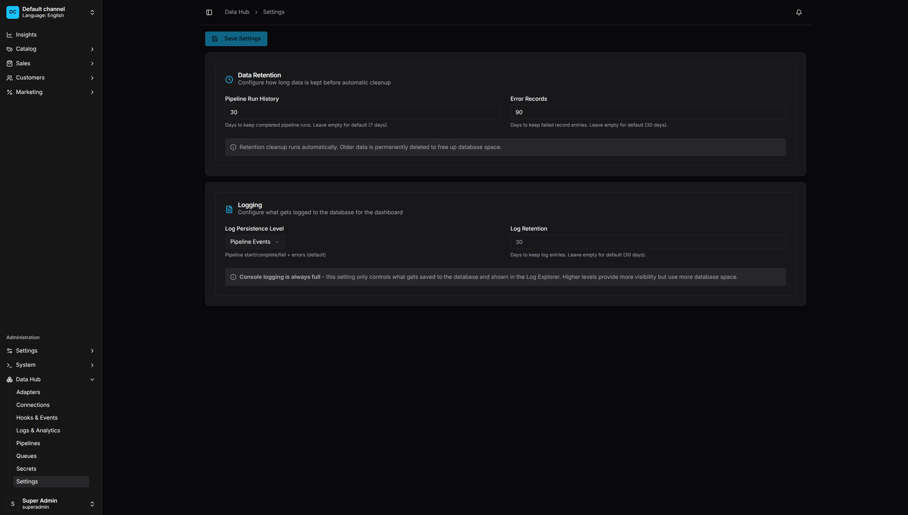

# Configuration Options

Complete reference for all Data Hub plugin configuration options.

<p align="center">
  
  <br>
  <em>Settings UI - Configure data retention and logging options</em>
</p>

## Plugin Options

```typescript
DataHubPlugin.init({
    // Core settings
    enabled: true,
    registerBuiltinAdapters: true,
    debug: false,

    // Retention
    retentionDaysRuns: 30,
    retentionDaysErrors: 90,

    // Code-first configuration
    pipelines: [],
    secrets: [],
    connections: [],
    adapters: [],
    feedGenerators: [],
    importTemplates: [],
    exportTemplates: [],
    scripts: {},
    configPath: undefined,

    // Runtime configuration
    runtime: {
        circuitBreaker: { failureThreshold: 5 },
        scheduler: { refreshIntervalMs: 60_000 },
    },

    // Optional OTLP/HTTP JSON metrics and trace export
    telemetry: process.env.OTEL_EXPORTER_OTLP_ENDPOINT ? {
        endpoint: process.env.OTEL_EXPORTER_OTLP_ENDPOINT,
        serviceName: 'vendure-data-hub',
        environment: process.env.NODE_ENV,
    } : undefined,

    // Security configuration
    security: {
        ssrf: { /* SSRF protection settings */ },
        script: { enabled: true },
    },

    // Notification settings (for gate approval emails)
    notifications: {
        smtp: { host: 'smtp.example.com', port: 587, /* ... */ },
    },
})
```

## Option Reference

### enabled

| | |
|---|---|
| Type | `boolean` |
| Default | `true` |
| Description | Enable code-first pipeline/connection synchronization and code-first secret registration |

```typescript
DataHubPlugin.init({
    enabled: process.env.DATAHUB_ENABLED !== 'false',
})
```

Setting `enabled: false` does not unregister the plugin's API, dashboard,
controllers, jobs, or built-in adapters. Omit `DataHubPlugin` from the Vendure
configuration when the entire plugin must be absent.

The standalone dashboard development server binds to `127.0.0.1` and requires
its configured port by default. Set `VITE_DEV_HOST=0.0.0.0` only when remote or
container access is intentional and protected by the surrounding network.

### registerBuiltinAdapters

| | |
|---|---|
| Type | `boolean` |
| Default | `true` |
| Description | Register built-in extractors, operators, and loaders |

Set to `false` if you want to register only custom adapters.

### debug

| | |
|---|---|
| Type | `boolean` |
| Default | `false` |
| Description | Enable detailed debug logging |

```typescript
DataHubPlugin.init({
    debug: process.env.NODE_ENV !== 'production',
})
```


### retentionDaysRuns

| | |
|---|---|
| Type | `number` |
| Default | `30` |
| Description | Days to keep pipeline run history |

Old runs are deleted automatically by the retention job. The job runs in the
Vendure server process under the configured distributed lock. Database work is
bounded to 1,000 rows per statement and 10,000 rows per entity per daily cycle;
larger backlogs continue in later cycles.

### retentionDaysErrors

| | |
|---|---|
| Type | `number` |
| Default | `90` |
| Description | Days to keep error records |

Quarantined records older than this are deleted.

### pipelines

| | |
|---|---|
| Type | `CodeFirstPipeline[]` |
| Default | `[]` |
| Description | Code-first pipeline definitions |

```typescript
interface CodeFirstPipeline {
    code: string;
    name: string;
    description?: string;
    enabled?: boolean;
    definition: PipelineDefinition;
    tags?: string[];
}
```

### secrets

| | |
|---|---|
| Type | `CodeFirstSecret[]` |
| Default | `[]` |
| Description | Code-first secret definitions |

```typescript
interface CodeFirstSecret {
    code: string;
    provider: 'INLINE' | 'ENV';
    value: string;
    metadata?: Record<string, unknown>;
    channelCodes?: string[];
}
```

Code-first secrets are always available in Vendure's default channel. Set `channelCodes`
to explicitly make a secret available to additional channels. Database-backed secrets
use the channel assignments managed in the Dashboard and Admin API.

ENV values must be one canonical environment-variable name and must exist in every executing API server or worker. Code-first INLINE values stay plaintext in source and are rejected in production even when DATAHUB_MASTER_KEY is set. The master key encrypts database-backed INLINE values only. In non-production, code-first INLINE requires a valid master key.

### connections

| | |
|---|---|
| Type | `CodeFirstConnection[]` |
| Default | `[]` |
| Description | Code-first connection definitions |

```typescript
interface CodeFirstConnection {
    code: string;           // Unique connection identifier
    type: string;           // Connection type (e.g., 'postgres', 'mysql', 'rest', 's3')
    settings: JsonObject;   // Connection settings - supports env var references like ${DB_HOST}
}
```

### adapters

| | |
|---|---|
| Type | `AdapterDefinition[]` |
| Default | `[]` |
| Description | Custom adapter registrations |

```typescript
interface AdapterDefinition {
    readonly type: 'EXTRACTOR' | 'OPERATOR' | 'LOADER' | 'VALIDATOR' | 'ENRICHER' | 'EXPORTER' | 'FEED' | 'SINK' | 'TRIGGER';
    readonly code: string;
    readonly name?: string;
    readonly description?: string;
    readonly category?: string;
    readonly schema: StepConfigSchema;
    readonly pure?: boolean;           // For operators: whether side-effect free
    readonly async?: boolean;
    readonly batchable?: boolean;
    readonly requires?: readonly string[];
    readonly icon?: string;
    readonly version?: string;
    readonly deprecated?: boolean;
    readonly deprecatedMessage?: string; // Required when deprecated is true
    readonly experimental?: boolean;
    readonly entityType?: string;      // For loaders: Vendure entity type
    readonly formatType?: string;      // For exporters/feeds: output format
    readonly patchableFields?: readonly string[];
    readonly editorType?: string;      // For operators: 'map' | 'template' | 'filter'
    readonly summaryTemplate?: string; // For operators: e.g. "${from} → ${to}"
}
```

Example:

```typescript
DataHubPlugin.init({
    adapters: [myCustomExtractor, currencyConvertOperator],
})
```

See [Extending the Plugin](../developer-guide/extending/README.md) for detailed documentation on creating custom adapters.

### feedGenerators

| | |
|---|---|
| Type | `CustomFeedGenerator[]` |
| Default | `[]` |
| Description | Custom feed generator registrations |

```typescript
DataHubPlugin.init({
    feedGenerators: [
        myCustomFeedGenerator,
    ],
})
```

### runtime

| | |
|---|---|
| Type | `RuntimeLimitsConfig` |
| Default | Built-in constants |
| Description | Global settings read by runtime services |

The current runtime consumers apply these groups:

```typescript
interface EffectiveRuntimeLimits {
    circuitBreaker?: {
        enabled?: boolean;
        failureThreshold?: number;
        successThreshold?: number;
        resetTimeoutMs?: number;
        failureWindowMs?: number;
    };
    scheduler?: {
        checkIntervalMs?: number;
        refreshIntervalMs?: number;
        minIntervalMs?: number;
        maxPipelineDiscovery?: number;
        maxTrackingEntries?: number;
        maxConsecutiveFailures?: number;
    };
}
```

Example:

```typescript
DataHubPlugin.init({
    runtime: {
        circuitBreaker: {
            failureThreshold: 10,
            resetTimeoutMs: 60_000,
        },
        scheduler: {
            checkIntervalMs: 30_000,
            refreshIntervalMs: 60_000,
            maxPipelineDiscovery: 1_000,
            maxTrackingEntries: 1_000,
            maxConsecutiveFailures: 5,
        },
    },
})
```

### telemetry

| | |
|---|---|
| Type | `OtlpTelemetryConfig` |
| Default | `undefined` |
| Description | Optional process-local metrics and completed-span export over OTLP/HTTP JSON |

| Field | Default | Valid values |
|---|---|---|
| `endpoint` | Required | HTTP(S) collector base URL without credentials, query, or fragment |
| `enabled` | `true` | Boolean |
| `metrics` | `true` | Boolean |
| `traces` | `true` | Boolean |
| `headers` | `{}` | Up to 32 valid HTTP header pairs |
| `serviceName` | `@oronts/vendure-data-hub-plugin` | OpenTelemetry `service.name` |
| `serviceVersion` | Unset | OpenTelemetry `service.version` |
| `environment` | Unset | OpenTelemetry `deployment.environment.name` |
| `exportIntervalMs` | `30000` | Integer from 1,000 to 300,000 |
| `requestTimeoutMs` | `5000` | Integer from 100 to 30,000 |
| `maxQueueSize` | `2048` | Integer from 1 to 10,000 |
| `maxBatchSize` | `256` | Integer from 1 to 1,000 |

The endpoint is a base URL; the exporter appends `/v1/metrics` and
`/v1/traces`. Omit the option or set `enabled: false` for no background
timer and no telemetry network requests. Header values should come from
deployment secrets. See
[Performance and Scaling](performance.md#otlpopentelemetry-export) for
cardinality, queue, failure, and data-minimization behavior.

### security

| | |
|---|---|
| Type | `SecurityConfig` |
| Default | See below |
| Description | Security configuration for SSRF protection and script execution |

```typescript
interface SecurityConfig {
    ssrf?: UrlSecurityConfig;
    script?: {
        enabled?: boolean;
        defaultTimeoutMs?: number; // integer from 1 to 300000
        validation?: {
            maxCodeLength?: number;
            maxConditionLength?: number;
            maxExpressionComplexity?: number;
            maxPropertyAccessDepth?: number;
            allowArrayMethods?: boolean;
            allowStringMethods?: boolean;
        };
    };
}
```

Node VM execution is not a hostile-code security boundary. Disable scripts when
pipeline authors are not trusted administrators.

Example:

```typescript
DataHubPlugin.init({
    security: {
        script: {
            enabled: true,
            defaultTimeoutMs: 10000,
        },
    },
})
```

### notifications

| | |
|---|---|
| Type | `{ smtp?: NotificationSmtpConfig }` |
| Default | `undefined` |
| Description | SMTP settings for gate approval notification emails |

```typescript
interface NotificationSmtpConfig {
    host: string;
    port: number;
    secure?: boolean;               // Defaults to true for port 465
    auth?: { user: string; pass: string };
    from?: string;                   // Sender address
}
```

Example:

```typescript
DataHubPlugin.init({
    notifications: {
        smtp: {
            host: 'smtp.example.com',
            port: 587,
            auth: { user: 'notifications@example.com', pass: process.env.SMTP_PASS! },
            from: 'DataHub <notifications@example.com>',
        },
    },
})
```

When configured, GATE steps with `notifyEmail` will send approval notification emails via this SMTP server. Without this configuration, email notifications are skipped with a warning.

### importTemplates

| | |
|---|---|
| Type | `CustomImportTemplate[]` |
| Default | Built-in templates (REST API Sync, JSON Import, Magento CSV, XML Feed, ERP Inventory, CRM Customer) |
| Description | Custom import templates for the import wizard |

```typescript
interface CustomImportTemplate {
    id: string;
    name: string;
    description: string;
    category: string;         // 'products' | 'customers' | 'inventory' | 'catalog'
    icon?: string;            // Supported lucide-react name; unknown names use the UI fallback
    requiredFields: string[];
    optionalFields?: string[];
    featured?: boolean;
    tags?: string[];
    formats?: string[];       // 'CSV' | 'JSON' | 'XML' | 'API'
    definition?: {
        sourceType?: string;
        fileFormat?: string;
        targetEntity?: string;
        existingRecords?: string;
        lookupFields?: string[];
        fieldMappings?: { sourceField: string; targetField: string }[];
    };
}
```

#### Including Connector Features

Connectors can ship templates, adapters, and pipeline factories. Pimcore imports use its configuration-aware generated pipelines rather than generic import-wizard cards. Register the configured connector and pass its generated pipelines explicitly. The `connectionCode` must match a saved `GRAPHQL` connection declared in the plugin's `connections` option:

```typescript
import { DataHubPlugin } from '@oronts/vendure-data-hub-plugin';
import { PimcoreConnector } from '@oronts/vendure-data-hub-plugin/connectors/pimcore';

const pimcore = PimcoreConnector({
    connectionCode: 'pimcore-graphql',
});

DataHubPlugin.init({
    connectors: [pimcore],
    pipelines: pimcore.pipelines,
});
```

If using `ConnectorRegistry` with multiple connectors:

```typescript
import { DataHubPlugin } from '@oronts/vendure-data-hub-plugin';
import { ConnectorRegistry, PimcoreConnector } from '@oronts/vendure-data-hub-plugin/connectors';

const registry = new ConnectorRegistry();
registry.register(PimcoreConnector, {
    connectionCode: 'pimcore-graphql',
});

DataHubPlugin.init({
    connectors: registry.getConnectors().map(({ connector, config }) => ({
        definition: connector,
        config,
    })),
    pipelines: registry.getAllPipelines(),
});
```

### exportTemplates

| | |
|---|---|
| Type | `CustomExportTemplate[]` |
| Default | Built-in templates (Product XML Feed, Order Analytics CSV, Customer GDPR Export, Inventory Report) |
| Description | Custom export templates for the export wizard |

```typescript
interface CustomExportTemplate {
    id: string;
    name: string;
    description: string;
    icon?: string;
    format: string;
    requiredFields?: string[];
    tags?: string[];
    definition?: {
        sourceEntity?: string;
        fields?: string[];
        formatOptions?: Record<string, unknown>;
    };
}
```

### scripts

| | |
|---|---|
| Type | `Record<string, ScriptFunction>` |
| Default | `undefined` |
| Description | Named script functions for use in pipeline hook actions |

Scripts registered via plugin options are auto-registered on startup and can be referenced by name in SCRIPT hook actions within pipeline definitions.

```typescript
type ScriptFunction = (
    records: readonly JsonObject[],
    context: HookContext,
    args?: JsonObject,
) => Promise<JsonObject[]> | JsonObject[];
```

Example:

```typescript
DataHubPlugin.init({
    scripts: {
        'validate-sku': async (records, context) => {
            return records.filter(r => r.sku && String(r.sku).length > 0);
        },
        'enrich-pricing': async (records, context) => {
            return records.map(r => ({ ...r, priceInCents: Number(r.price) * 100 }));
        },
    },
})
```

Use in pipeline definitions:

```typescript
hooks: {
    AFTER_EXTRACT: [{ type: 'SCRIPT', scriptName: 'validate-sku' }],
    BEFORE_LOAD: [{ type: 'SCRIPT', scriptName: 'enrich-pricing', args: { currency: 'USD' } }],
}
```

Scripts have full access to the `HookContext` (pipelineId, runId, stage) and optional `args` passed from the hook action. They can filter, transform, enrich, or reject records.

### configPath

| | |
|---|---|
| Type | `string` |
| Default | `undefined` |
| Description | Path to external config file |

Load configuration from YAML or JSON file:

```typescript
DataHubPlugin.init({
    configPath: './config/data-hub.yaml',
})
```

Relative paths resolve from the process working directory. Only .json, .yaml, and .yml are accepted, and the document root must be an object. When configPath is configured, missing, unreadable, unsupported, malformed, or invalid secret configuration aborts startup.

File secrets stay in memory. They are loaded before secret consumers, then inline plugin secret options are overlaid so inline options win on cross-source codes. Duplicate codes within the file or within inline options are rejected.

During application bootstrap, one API server validates the complete effective connection and pipeline configuration, then reconciles it under a distributed lock. Inline entries override same-code file entries, unchanged rows are not rewritten, and validation fails before any configuration row is changed. Workers perform no writes; they wait for the shared database to match before schedule, message, and file-trigger discovery starts. New or changed pipeline definitions still require the normal review and publish workflow before execution.

A config file is not an encrypted secret store. Production code-first INLINE values are rejected; use ENV references.

## Environment Variables

Use environment variables in configurations:

### Redis coordination

`DATAHUB_REDIS_URL` selects Redis for distributed locks and shared incoming
webhook rate limits. `REDIS_URL` is accepted when the Data Hub-specific variable
is unset. The webhook limiter uses atomic fixed-window counters with bounded
connection and command timeouts across API instances.

When neither URL is configured, webhook rate limiting remains process-local for
local development and single-instance deployments. When a URL is configured
but Redis becomes unavailable after startup, incoming webhook admission fails
closed with `503` instead of silently switching to independent local counters.

The same URL also auto-selects Redis for distributed locks unless
`DATAHUB_LOCK_BACKEND` selects another valid backend. Redis lock initialization
is intentionally fail-closed and can prevent application bootstrap. To isolate
webhook-limiter outages from lock initialization on PostgreSQL, set
`DATAHUB_LOCK_BACKEND=POSTGRES` explicitly.

### Server-local output

`DATA_HUB_EXPORT_ROOT` sets the root for local exporter and feed files. It defaults to `<cwd>/exports` and is resolved when the process starts. In production, point it at a writable persistent directory:

```bash
DATA_HUB_EXPORT_ROOT=/var/lib/vendure-data-hub/exports
```

Pipeline values stay relative to that root: use `path: 'catalog'` for a local exporter directory and `outputPath: 'feeds/catalog.xml'` for a feed. Do not put absolute server paths or URLs in those pipeline fields. FTP/SFTP remote paths and HTTP destination URLs use their destination-specific settings.

### Asset storage

| Variable | Required | Description |
|----------|----------|-------------|
| `DATA_HUB_STORAGE_TYPE` | No | `local` (default) or `s3`; unknown values fail startup |
| `DATA_HUB_STORAGE_PATH` | Local only | Local base directory; defaults to `data-hub-uploads` |
| `DATA_HUB_S3_BUCKET` | S3 | Bucket name |
| `DATA_HUB_S3_REGION` | No | Region; defaults to `us-east-1` |
| `DATA_HUB_S3_ACCESS_KEY_ID` | No | Static access key; configure together with the secret key |
| `DATA_HUB_S3_SECRET_ACCESS_KEY` | No | Static secret key; configure together with the access key |
| `DATA_HUB_S3_ENDPOINT` | No | HTTP(S) endpoint for an S3-compatible service |
| `DATA_HUB_S3_PREFIX` | No | Object-key prefix |
| `DATA_HUB_S3_URL_EXPIRY` | No | Positive integer signed-URL lifetime; defaults to `3600` seconds |

When static S3 credentials are omitted, the AWS SDK credential chain is used.
Prefer a workload role in production.

### In Secrets

```typescript
secrets: [
    { code: 'api-key', provider: 'ENV', value: 'MY_API_KEY' },
]
```

### In Connections

Use `${VAR}` for non-secret values and Secret Codes for credentials:

```typescript
DataHubPlugin.init({
    secrets: [
        { code: 'db-password', provider: 'ENV', value: 'DB_PASSWORD' },
    ],
    connections: [
        {
            code: 'db',
            type: 'POSTGRES',
            settings: {
                host: '${DB_HOST}',
                port: 5432,
                database: '${DB_NAME}',
                username: '${DB_USER}',
                passwordSecretCode: 'db-password',
            },
        },
    ],
})
```

## External Config File

### YAML Format

```yaml
# data-hub.yaml
secrets:
  - code: supplier-api
    provider: ENV
    value: SUPPLIER_API_KEY
  - code: erp-db-password
    provider: ENV
    value: ERP_DB_PASSWORD

connections:
  - code: erp-db
    type: POSTGRES
    settings:
      host: ${ERP_DB_HOST}
      port: 5432
      database: erp
      username: ${ERP_DB_USER}
      passwordSecretCode: erp-db-password

pipelines:
  - code: product-sync
    name: Product Sync
    enabled: true
    definition:
      version: 1
      steps:
        - key: trigger
          type: TRIGGER
          config:
            type: SCHEDULE
            cron: "0 2 * * *"
```

### JSON Format

```json
{
    "secrets": [
        { "code": "api-key", "provider": "ENV", "value": "API_KEY" }
    ],
    "connections": [],
    "pipelines": []
}
```

## Runtime Settings

These settings can be changed via Admin UI or GraphQL:

| Setting | Description |
|---------|-------------|
| `retentionDaysRuns` | Run history retention |
| `retentionDaysErrors` | Error retention |
| `retentionDaysLogs` | Positive days purge older pipeline logs; `null` or `0` disables log purging |
| `logPersistenceLevel` | Minimum log level to persist |

```graphql
mutation {
    updateDataHubSettings(input: {
        retentionDaysRuns: 60
        retentionDaysErrors: 90
        logPersistenceLevel: PIPELINE
    }) {
        retentionDaysRuns
        retentionDaysErrors
    }
}
```

## Job Queue Configuration

Configure Vendure's job queue for pipeline execution:

```typescript
// vendure-config.ts
export const config: VendureConfig = {
    jobQueueOptions: {
        activeQueues: ['default', 'data-hub.event-trigger-outbox', 'data-hub.webhook-retry', 'data-hub.run'],
        pollInterval: 1000,
    },
};
```

### Queue Names

| Queue | Purpose |
|-------|---------|
| `data-hub.run` | Pipeline execution jobs |
| `data-hub.event-trigger-outbox` | Durable Vendure event handoff jobs |
| `data-hub.webhook-retry` | Durable outgoing webhook delivery jobs |

Schedule checking uses process timers plus occurrence-scoped distributed
leases. A cron minute or fixed-interval bucket is claimed once across API
processes. Scheduled starts are enqueued on `data-hub.run`; no separate schedule
queue is required.

### Worker Scaling

For high-volume pipelines, run dedicated workers:

```typescript
// worker.ts
import { bootstrapWorker, Logger } from '@vendure/core';
import config from './vendure-config';

bootstrapWorker(config)
    .then(worker => worker.startJobQueue())
    .then(worker => worker.startHealthCheckServer({ port: 3020 }))
    .catch(err => {
        Logger.error(
            `Worker failed to start: ${err instanceof Error ? err.message : String(err)}`,
            'DataHubWorker',
        );
        process.exitCode = 1;
    });
```

## Example Configurations

### Development

```typescript
DataHubPlugin.init({
    enabled: true,
    debug: true,
    retentionDaysRuns: 7,
    secrets: [
        { code: 'test-api', provider: 'ENV', value: 'TEST_API_KEY' },
    ],
})
```

### Production

```typescript
DataHubPlugin.init({
    enabled: true,
    debug: false,
    retentionDaysRuns: 30,
    retentionDaysErrors: 90,
    configPath: './config/data-hub.yaml',
})
```

### Multi-Environment

```typescript
const isProd = process.env.NODE_ENV === 'production';

DataHubPlugin.init({
    enabled: true,
    debug: !isProd,
    retentionDaysRuns: isProd ? 30 : 7,
    secrets: [
        { code: 'api-key', provider: 'ENV', value: 'API_KEY' },
        { code: 'main-db-password', provider: 'ENV', value: 'DB_PASSWORD' },
    ],
    connections: [
        {
            code: 'main-db',
            type: 'POSTGRES',
            settings: {
                host: '${DB_HOST}',
                port: 5432,
                database: '${DB_NAME}',
                username: '${DB_USER}',
                passwordSecretCode: 'main-db-password',
            },
        },
    ],
})
```
