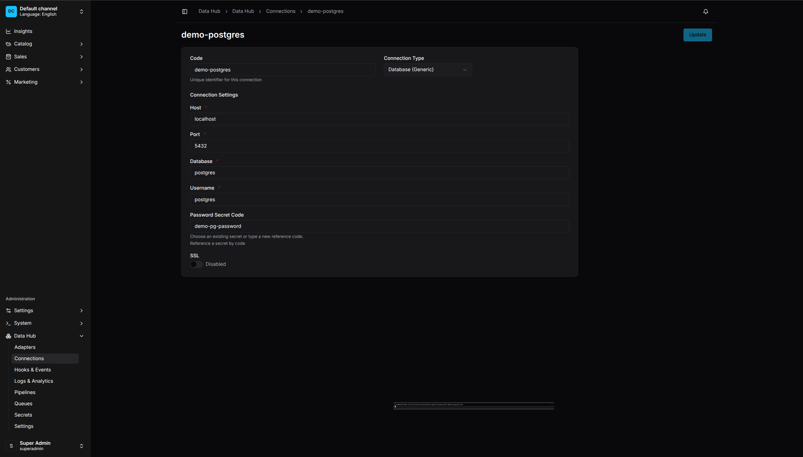

# Managing Connections

Connections store reusable configuration for external systems like databases, APIs, and cloud storage.

<p align="center">
  
  <br>
  <em>Connections List - Manage all external system connections</em>
</p>

## Why Use Connections

- **Reusability** - Use the same connection in multiple pipelines
- **Security** - Credentials are stored securely, not in pipeline config
- **Maintainability** - Update connection details in one place
- **Environment Flexibility** - Different connections for dev/staging/prod

## Creating a Connection

1. Go to **Data Hub > Connections**
2. Click **Create Connection**
3. Select the connection type
4. Configure the connection settings
5. Click **Save**

<p align="center">
  
  <br>
  <em>Connection Configuration - Multiple connection types supported</em>
</p>

## Connection Types

### HTTP / REST API

Connect to REST APIs:

| Field | Description |
|-------|-------------|
| Base URL | API base URL (e.g., `https://api.example.com`) |
| Timeout | Request timeout in milliseconds |
| Headers | Default headers for all requests |
| Auth Type | None, Bearer Token, Basic Auth, API Key |
| Secret Code | Reference to secret for credentials |

Example:
```
Code: supplier-api
Type: http
Base URL: https://api.supplier.com/v1
Timeout: 30000
Auth Type: Bearer Token
Secret Code: supplier-api-token
```

### PostgreSQL

Connect to PostgreSQL databases:

| Field | Description |
|-------|-------------|
| Host | Database server hostname |
| Port | Server port (default: 5432) |
| Database | Database name |
| Username | Database user |
| Password Secret | Reference to password secret |
| SSL | Enable SSL connection |
| Pool Size | Connection pool size |

Example:
```
Code: erp-db
Type: postgres
Host: db.example.com
Port: 5432
Database: erp
Username: vendure_reader
Password Secret: erp-db-password
SSL: true
Pool Size: 5
```

### MySQL

Connect to MySQL databases:

| Field | Description |
|-------|-------------|
| Host | Database server hostname |
| Port | Server port (default: 3306) |
| Database | Database name |
| Username | Database user |
| Password Secret | Reference to password secret |

### Microsoft SQL Server

Connect to MSSQL databases:

| Field | Description |
|-------|-------------|
| Host | Server hostname |
| Port | Server port (default: 1433) |
| Database | Database name |
| Username | Database user |
| Password Secret | Reference to password secret |
| Encrypt | Enable encryption |
| Trust Server Certificate | Trust self-signed certs |

### Amazon S3

Connect to S3 or compatible storage (MinIO, DigitalOcean Spaces):

| Field | Description |
|-------|-------------|
| Region | AWS region (e.g., `us-east-1`) |
| Bucket | Default bucket name |
| Access Key ID Secret | Reference to access key secret |
| Secret Access Key Secret | Reference to secret key |
| Endpoint | Custom endpoint for S3-compatible services |

Example for MinIO:
```
Code: local-storage
Type: s3
Region: us-east-1
Bucket: imports
Endpoint: http://minio:9000
Access Key ID Secret: minio-access-key
Secret Access Key Secret: minio-secret-key
```

### FTP / SFTP

Connect to file servers:

| Field | Description |
|-------|-------------|
| Host | Server hostname |
| Port | Server port (FTP: 21, SFTP: 22) |
| Protocol | FTP or SFTP |
| Username | Login username |
| Password Secret | Reference to password secret |
| Private Key Secret | For SFTP key-based auth |
| Base Path | Default directory |

## Testing Connections

1. After creating a connection, click **Test**
2. The system will attempt to connect
3. View success or error message
4. Fix any issues before using in pipelines

## Using Connections in Pipelines

Reference a connection by its code:

### In Visual Editor

1. Add an Extract or Export step
2. Select the adapter (e.g., Database)
3. Choose the connection from the dropdown
4. Configure step-specific settings

### In DSL

```typescript
.extract('fetch-products', {
    adapterCode: 'httpApi',
    connectionCode: 'erp-api',  // Connection code
    url: '/products',
})
```

## Environment Variables

Connection settings can reference environment variables:

```
Host: ${DB_HOST}
Port: ${DB_PORT}
Database: ${DB_NAME}
```

Variables are resolved at runtime. This allows different values for different environments without changing the connection configuration.

## Connection Health

View connection status:

1. Go to **Data Hub > Connections**
2. Each connection shows a health indicator:
   - 🟢 Healthy - Last test successful
   - 🟡 Unknown - Not tested recently
   - 🔴 Failed - Last test failed

Run **Test** to update the status.

## Editing Connections

1. Go to **Data Hub > Connections**
2. Click on a connection
3. Modify settings
4. Click **Save**

Note: Changing a connection affects all pipelines using it.

## Deleting Connections

1. Go to **Data Hub > Connections**
2. Click the menu (⋮) on a connection
3. Select **Delete**
4. Confirm deletion

Warning: You cannot delete a connection used by active pipelines.

## Best Practices

### Naming

- Use descriptive codes: `production-mysql`, `staging-api`
- Include environment: `dev-erp-db`, `prod-erp-db`
- Include purpose: `supplier-catalog-api`

### Security

- Always use secrets for credentials, never inline passwords
- Use read-only database users when possible
- Limit pool sizes to prevent overwhelming external systems

### Testing

- Test connections before using in pipelines
- Set up monitoring for production connections
- Have backup connections for critical systems
