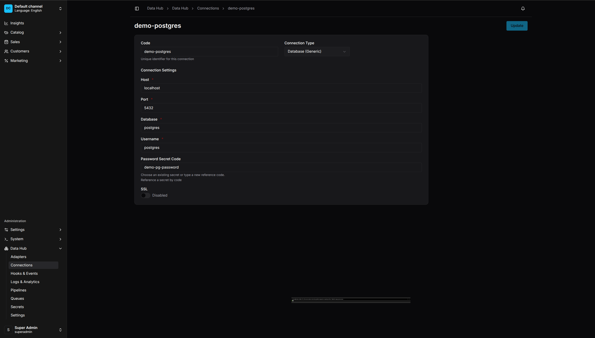

# Managing Connections

Connections store reusable configuration for external systems like databases, APIs, and cloud storage.

<p align="center">
  
  <br>
  <em>Connections List - Manage all external system connections</em>
</p>

## Why Use Connections

- **Reusability** - Use the same connection in multiple pipelines
- **Security** - Credentials are stored securely, not in pipeline config
- **Maintainability** - Update connection details in one place
- **Environment Flexibility** - Different connections for dev/staging/prod

## Creating a Connection

1. Go to **Data Hub > Connections**
2. Click **Create Connection**
3. Select the connection type
4. Configure the connection settings
5. Click **Save**

## Code-First Ownership

Connections loaded from deployed plugin configuration show a **Code-first**
badge in the list and a read-only banner on the detail page. Their code, type,
and configuration must be changed in the deployed definition, then applied by
restarting the API application. The backend rejects update and delete mutations
for these connections even if a client bypasses the Dashboard.

Removing the deployed definition releases the existing row to Dashboard
ownership on the next API startup; it does not delete the connection. Review
all pipeline references and test the released connection before editing or
deleting it.

<p align="center">
  
  <br>
  <em>Connection Configuration - Multiple connection types supported</em>
</p>

## Connection Types

Supported canonical types are `HTTP`, `REST`, `GRAPHQL`, `POSTGRES`, `MYSQL`,
`S3`, `FTP`, `SFTP`, `RABBITMQ`, `SQS`, `REDIS`, and `CUSTOM`. Generic
or vendor types outside this list are rejected. SQLite remains available only
as a code-first database extractor configuration.

### HTTP / REST API

Connect to REST APIs:

| Field | Description |
|-------|-------------|
| Base URL | API base URL (e.g., `https://api.example.com`) |
| Timeout | Request timeout in milliseconds |
| Headers | Default headers for all requests |
| Auth Type | None, Bearer Token, Basic Auth, API Key |
| Secret Code | Reference to secret for credentials |

The base URL must use HTTP or HTTPS and must not contain a username or
password. Authenticated connections require a base URL because it defines the
origin to which credentials may be sent. Default headers accept only
non-sensitive request headers; configure authorization, cookies, tokens, API
keys, and signatures through Secret Code-backed authentication instead.

Basic authentication can use either a literal username or a Username Secret
Code. The password always uses a Secret Code. API key header names cannot
override request-routing or framing headers such as `Host`, `Content-Length`,
`Connection`, or `Upgrade`.

Example:
```
Code: supplier-api
Type: HTTP
Base URL: https://api.supplier.com/v1
Timeout: 30000
Auth Type: Bearer Token
Secret Code: supplier-api-token
```

### PostgreSQL

Connect to PostgreSQL databases:

| Field | Description |
|-------|-------------|
| Host | Database server hostname |
| Port | Server port (default: 5432) |
| Database | Database name |
| Username | Database user |
| Password Secret | Reference to password secret |
| SSL | Enable SSL connection |

Example:
```
Code: erp-db
Type: POSTGRES
Host: db.example.com
Port: 5432
Database: erp
Username: vendure_reader
Password Secret: erp-db-password
SSL: true
```

### MySQL

Connect to MySQL databases:

| Field | Description |
|-------|-------------|
| Host | Database server hostname |
| Port | Server port (default: 3306) |
| Database | Database name |
| Username | Database user |
| Password Secret | Reference to password secret |

### Amazon S3

Connect to S3 or compatible storage (MinIO, DigitalOcean Spaces):

| Field | Description |
|-------|-------------|
| Region | AWS region (e.g., `us-east-1`) |
| Bucket | Default bucket name |
| Access Key ID Secret | Reference to access key secret |
| Secret Access Key Secret | Reference to secret key |
| Endpoint | Custom endpoint for S3-compatible services |

Example for MinIO:
```
Code: local-storage
Type: S3
Region: us-east-1
Bucket: imports
Endpoint: http://minio:9000
Access Key ID Secret: minio-access-key
Secret Access Key Secret: minio-secret-key
```

### FTP / SFTP

Connect to file servers:

| Field | Description |
|-------|-------------|
| Host | Server hostname |
| Port | Server port (FTP: 21, SFTP: 22) |
| Protocol | FTP or SFTP |
| Username | Login username |
| Password Secret | Reference to password secret |
| Private Key Secret | For SFTP key-based auth |
| Host Key Fingerprint Secret (`hostKeyFingerprintSecretCode`) | Trusted OpenSSH `SHA256:<base64>` SFTP server fingerprint; required in production |
| Base Path | Default directory |


SFTP host-key fingerprints use OpenSSH `SHA256:<base64>` format and are required in production. Validate network access and credentials from the environment that runs Vendure before enabling a consuming pipeline; the current dashboard does not expose a connection-test mutation.

### Custom

Custom connections store a JSON object whose structure is defined by the
integration that consumes it. The dashboard validates and preserves nested JSON
objects rather than storing JSON text. Credential-like properties must use
environment references such as `${ERP_PASSWORD}`; plaintext credential values
and URLs containing embedded usernames or passwords are rejected.

## Using Connections in Pipelines

Reference a connection by its code:

### In Visual Editor

1. Add an Extract or Export step
2. Select the adapter (e.g., Database)
3. Choose the connection from the dropdown
4. Configure step-specific settings

### In DSL

```typescript
.extract('fetch-products', {
    adapterCode: 'httpApi',
    connectionCode: 'erp-api',  // Connection code
    url: '/products',
})
```

## Environment Variables

Connection settings can reference environment variables:

```
Host: ${DB_HOST}
Database: ${DB_NAME}
```

Variables are resolved at runtime for string-valued fields. Typed number and
boolean fields must be stored with their native JSON types, so configure ports
as numbers rather than `${...}` placeholders.

## Editing Connections

1. Go to **Data Hub > Connections**
2. Click on a connection
3. Modify settings
4. Click **Save**

Changing configuration within the same connection type affects all pipelines
using it. A connection referenced by a published pipeline cannot change its
code or type until those pipelines are updated and republished. A pinned
nonterminal run snapshot also blocks code/type changes because queued, running,
paused, and cancellation-pending runs still resolve the referenced connection.

## Deleting Connections

1. Go to **Data Hub > Connections**
2. Click the menu (⋮) on a connection
3. Select **Delete**
4. Confirm deletion

Connections referenced by a published pipeline or pinned nonterminal run
snapshot cannot be renamed, changed to a different type, or deleted. Wait for
the run to finish or cancel it before removing the connection.
The delete mutation returns `NOT_DELETED` when a tracked reference blocks it.

## Best Practices

### Naming

- Use descriptive codes: `production-mysql`, `staging-api`
- Include environment: `dev-erp-db`, `prod-erp-db`
- Include purpose: `supplier-catalog-api`

### Security

- Always use secrets for credentials, never inline passwords
- Never place credentials in a connection URL
- Keep default headers non-sensitive and use Secret Code-backed authentication
- Use read-only database users when possible
- Limit pool sizes to prevent overwhelming external systems

### Testing

- Validate connectivity and credentials from every API server or worker that can execute the pipeline
- Set up monitoring for production connections
- Have backup connections for critical systems
