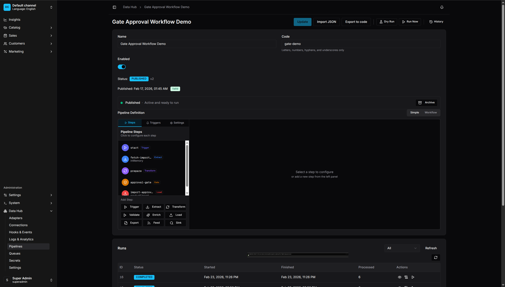

# Creating Pipelines

Build data pipelines using the visual drag-and-drop editor.

<p align="center">
  
  <br>
  <em>Pipeline Management - View and manage all your data pipelines</em>
</p>

## Creating a New Pipeline

1. Go to **Data Hub > Pipelines**
2. Click **Create Pipeline**
3. Enter:
   - **Code** - Unique identifier (lowercase, hyphens allowed)
   - **Name** - Human-readable name
   - **Description** - Optional description
4. Click **Create**

## The Pipeline Editor

The editor has three main areas:

- **Toolbar** - Save, run, and validate actions
- **Canvas** - Drag-and-drop area for building pipelines
- **Sidebar** - Step configuration panel

### Simple Mode

<p align="center">
  
  <br>
  <em>Simple Mode - Step-by-step list view for building pipelines</em>
</p>

### Workflow Mode

<p align="center">
  
  <br>
  <em>Workflow Mode - Visual drag-and-drop canvas with node palette</em>
</p>

## Adding Steps

### Trigger Step

Every pipeline needs a trigger to define how it starts.

1. Drag a **Trigger** from the palette
2. Configure the trigger type:
   - **Manual** - Run via UI or API
   - **Schedule** - Cron-based scheduling
   - **Webhook** - HTTP endpoint trigger
   - **Event** - Vendure event trigger

### Extract Step

Extract steps pull data from sources.

1. Drag an **Extract** node
2. Select an adapter:
   - **HTTP API** (`httpApi`) - REST API endpoints with pagination, authentication, and retry support
   - **File** (`file`) - Parse CSV, JSON, XML, XLSX, NDJSON, TSV files
   - **GraphQL** (`graphql`) - External GraphQL endpoints
   - **Vendure Query** (`vendureQuery`) - Vendure entity data
3. Configure the adapter settings
4. Connect to the trigger

### Transform Step

Transform steps modify records.

1. Drag a **Transform** node
2. Add operators:
   - Click **Add Operator**
   - Select operator type
   - Configure parameters
3. Operators execute in order
4. Connect to the previous step

### Load Step

Load steps create or update Vendure entities or send data externally.

1. Drag a **Load** node
2. Select a loader:
   - **Product** (`productUpsert`) - Create/update products
   - **Variant** (`variantUpsert`) - Create/update product variants
   - **Customer** (`customerUpsert`) - Create/update customers
   - **Collection** (`collectionUpsert`) - Create/update collections
   - **Promotion** (`promotionUpsert`) - Create/update promotions
   - **Stock** (`stockAdjust`) - Adjust inventory levels
   - **Order Note** (`orderNote`) - Add notes to orders
   - **Order Transition** (`orderTransition`) - Change order states
   - **REST Post** (`restPost`) - Send data to external APIs
3. Configure:
   - **Strategy** - CREATE, UPDATE, UPSERT, SOFT_DELETE, or HARD_DELETE
   - **Field Mappings** - map source fields to entity fields
4. Connect to the previous step

## Connecting Steps

1. Click the output port (right side) of a step
2. Drag to the input port (left side) of another step
3. Release to create a connection

Connections show the data flow direction. A record must pass through connected steps in order.

## Step Configuration

Click a step to open its configuration panel:

### Common Settings

- **Key** - Unique step identifier
- **Throughput** - Batch size, concurrency, rate limiting
- **Async** - Run asynchronously (advanced)

### Adapter Settings

Each adapter has specific settings. See [Reference](../reference/README.md) for details.

## Branching with Route

Route steps split data flow based on conditions:

1. Drag a **Route** node
2. Add branches:
   - **Branch Name** - Identifier for the branch
   - **Condition** - Field, operator, value
3. Connect each branch to different steps
4. Optionally set a default route

Example: Route products by category:
- Branch "electronics": category equals "electronics"
- Branch "clothing": category equals "clothing"
- Default: general processing

## Validating Pipelines

Before running, validate your pipeline:

1. Click **Validate** in the toolbar
2. Review any issues:
   - Missing required fields
   - Invalid configurations
   - Disconnected steps

Fix all issues before saving.

## Saving Pipelines

1. Click **Save** in the toolbar
2. The pipeline is saved to the database
3. Code-first pipelines cannot be edited via UI (read-only)

## Running Pipelines

### Manual Run

1. Click **Run** in the toolbar
2. Confirm the run
3. Monitor progress in the Runs view

### With Parameters

Some pipelines accept input parameters:

1. Click **Run with Parameters**
2. Enter parameter values
3. Click **Run**

## Pipeline States

| State | Description |
|-------|-------------|
| Draft | Not yet saved or validated |
| Enabled | Ready to run, schedules active |
| Disabled | Cannot be run, schedules inactive |
| Running | Currently executing |

## Duplicating Pipelines

1. Open the pipeline list
2. Click the menu (⋮) on a pipeline
3. Select **Duplicate**
4. Edit the new pipeline's code and name

## Deleting Pipelines

1. Open the pipeline list
2. Click the menu (⋮) on a pipeline
3. Select **Delete**
4. Confirm deletion

Note: Deleting a pipeline removes all run history.

## Hooks

Hooks allow you to execute custom code at specific stages of pipeline execution. Use hooks to modify data, send notifications, trigger other pipelines, or integrate with external systems.

### Hook Stages

**Data Processing Stages:**

| Stage | When It Runs | Can Modify Records |
|-------|--------------|-------------------|
| `BEFORE_EXTRACT` | Before data extraction | Yes (seed records) |
| `AFTER_EXTRACT` | After data is extracted | Yes |
| `BEFORE_TRANSFORM` | Before transformation | Yes |
| `AFTER_TRANSFORM` | After transformation | Yes |
| `BEFORE_VALIDATE` | Before validation | Yes |
| `AFTER_VALIDATE` | After validation | Yes |
| `BEFORE_ENRICH` | Before enrichment | Yes |
| `AFTER_ENRICH` | After enrichment | Yes |
| `BEFORE_ROUTE` | Before routing | Yes |
| `AFTER_ROUTE` | After routing | Yes |
| `BEFORE_LOAD` | Before loading | Yes |
| `AFTER_LOAD` | After loading | No |

**Lifecycle Stages:**

| Stage | When It Runs |
|-------|--------------|
| `PIPELINE_STARTED` | Pipeline execution begins |
| `PIPELINE_COMPLETED` | Pipeline finishes successfully |
| `PIPELINE_FAILED` | Pipeline fails |
| `ON_ERROR` | When an error occurs |
| `ON_RETRY` | When a record is retried |
| `ON_DEAD_LETTER` | When a record is sent to dead letter queue |

### Hook Types

#### Interceptor Hooks

Interceptors run JavaScript code that can modify the records array:

```typescript
.hooks({
    AFTER_EXTRACT: [{
        type: 'INTERCEPTOR',
        name: 'Add metadata',
        code: `
            return records.map(r => ({
                ...r,
                extractedAt: new Date().toISOString(),
                source: 'supplier-api',
            }));
        `,
        failOnError: false,  // Don't fail pipeline if hook fails
        timeout: 5000,       // 5 second timeout
    }],
    BEFORE_LOAD: [{
        type: 'INTERCEPTOR',
        name: 'Filter invalid',
        code: `
            return records.filter(r => r.sku && r.name);
        `,
    }],
})
```

**Available in interceptor code:**
- `records` - The current records array
- `context` - Hook context with `pipelineId`, `runId`, `stage`
- Standard JavaScript: `Array`, `Object`, `String`, `Number`, `Date`, `JSON`, `Math`
- `console.log/warn/error` - Logged to pipeline logs

#### Script Hooks

Script hooks reference pre-registered functions:

```typescript
// Register at startup
hookService.registerScript('addSegment', async (records, context, args) => {
    const threshold = args?.threshold || 1000;
    return records.map(r => ({
        ...r,
        segment: r.totalSpent > threshold ? 'vip' : 'standard',
    }));
});

// Use in pipeline
.hooks({
    AFTER_TRANSFORM: [{
        type: 'SCRIPT',
        scriptName: 'addSegment',
        args: { threshold: 5000 },
    }],
})
```

#### Webhook Hooks

Send HTTP notifications to external systems:

```typescript
.hooks({
    PIPELINE_COMPLETED: [{
        type: 'WEBHOOK',
        url: 'https://slack.example.com/webhook',
        headers: { 'Content-Type': 'application/json' },
    }],
    PIPELINE_FAILED: [{
        type: 'WEBHOOK',
        url: 'https://pagerduty.example.com/alert',
        secret: 'webhook-signing-secret',  // HMAC signature
        signatureHeader: 'X-Signature',
        retryConfig: {
            maxAttempts: 5,
            initialDelayMs: 1000,
            backoffMultiplier: 2,
        },
    }],
})
```

#### Emit Hooks

Emit Vendure domain events:

```typescript
.hooks({
    PIPELINE_COMPLETED: [{
        type: 'EMIT',
        event: 'ProductSyncCompleted',
    }],
})
```

#### Trigger Pipeline Hooks

Start another pipeline with the current records:

```typescript
.hooks({
    AFTER_LOAD: [{
        type: 'TRIGGER_PIPELINE',
        pipelineCode: 'reindex-search',
    }],
})
```

### Testing Hooks

Test hooks without running the full pipeline:

1. Go to **Data Hub > Hooks**
2. Select a pipeline
3. Choose a hook stage
4. Click **Test**
5. View the result and any modifications

### Hook Best Practices

- Use interceptors for data modification
- Use webhooks for notifications
- Keep interceptor code simple and fast
- Use script hooks for reusable logic
- Set appropriate timeouts (default: 5000ms)
- Use `failOnError: false` for non-critical hooks

---

## Dry Run

Test pipelines without persisting changes:

1. Click **Dry Run** in the toolbar
2. Review the results:
   - **Summary** - Record counts (processed, succeeded, failed)
   - **Record Diff** - Before/after comparison for each step
   - **Step Details** - Timing and record flow per step
3. Fix any issues before running the real pipeline

Dry run executes the full pipeline logic but doesn't commit changes to the database.

---

## Best Practices

### Naming

- Use descriptive codes: `product-import-daily` not `pipeline-1`
- Include frequency: `inventory-sync-hourly`
- Include source: `erp-product-sync`

### Testing

- Use **Dry Run** to test pipelines before production
- Test with small datasets first
- Use the **Step Tester** to test individual steps
- Validate before running on production data

### Error Handling

- Add validation operators to catch bad data early
- Configure error handling strategy: `continue`, `stop`, or `dead-letter`
- Use hooks to send alerts on failures
- Review quarantined records regularly

### Performance

- Use batch sizes appropriate for your data
- Limit concurrency for external APIs
- Schedule heavy pipelines during off-peak hours
- Use delta filtering to process only changed records
