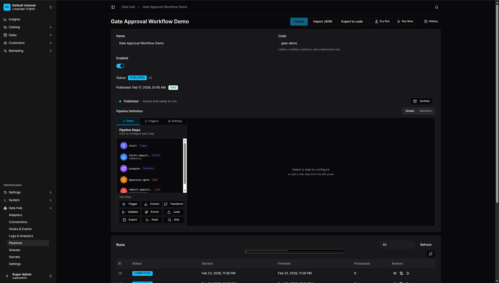

# Creating Pipelines

Build data pipelines using the visual drag-and-drop editor.

<p align="center">
  
  <br>
  <em>Pipeline Management - View and manage all your data pipelines</em>
</p>

## Creating a New Pipeline

1. Go to **Data Hub > Pipelines**
2. Click **Create Pipeline**
3. Enter:
   - **Code** - Unique identifier (lowercase, hyphens allowed)
   - **Name** - Human-readable name
   - **Description** - Optional description
4. Click **Create**

## The Pipeline Editor

The editor has three main areas:

- **Toolbar** - Save, run, and validate actions
- **Canvas** - Drag-and-drop area for building pipelines
- **Sidebar** - Step configuration panel

### Simple Mode

<p align="center">
  
  <br>
  <em>Simple Mode - Step-by-step list view for building pipelines</em>
</p>

### Workflow Mode

<p align="center">
  
  <br>
  <em>Workflow Mode - Visual drag-and-drop canvas with node palette</em>
</p>

## Adding Steps

### Trigger Step

Every pipeline needs a trigger to define how it starts.

1. Drag a **Trigger** from the palette
2. Configure the trigger type:
   - **Manual** - Run via UI or API
   - **Schedule** - Cron-based scheduling
   - **Webhook** - HTTP endpoint trigger
   - **Event** - Vendure event trigger

### Extract Step

Extract steps pull data from sources.

1. Drag an **Extract** node
2. Select an adapter:
   - **HTTP API** (`httpApi`) - REST API endpoints with pagination, authentication, and retry support
   - **CSV / JSON / XML / XLSX** (`csv`, `json`, `xml`, `xlsx`) - Parse Data Hub uploads or the inline fields supported by the selected format
   - **GraphQL** (`graphql`) - External GraphQL endpoints
   - **Vendure Query** (`vendureQuery`) - Vendure entity data
3. Configure the adapter settings
4. Optionally select an immutable **Registry schema** version to validate
   extracted records
5. Connect to the trigger

### Transform Step

Transform steps modify records.

1. Drag a **Transform** node
2. Add operators:
   - Click **Add Operator**
   - Select operator type
   - Configure parameters
3. Operators execute in order
4. Connect to the previous step

### Load Step

Load steps create or update Vendure entities or send data externally.

1. Drag a **Load** node
2. Select a loader:
   - **Product** (`productUpsert`) - Create/update products
   - **Variant** (`variantUpsert`) - Create/update product variants
   - **Customer** (`customerUpsert`) - Create/update customers
   - **Collection** (`collectionUpsert`) - Create/update collections
   - **Promotion** (`promotionUpsert`) - Create/update promotions
   - **Stock** (`stockAdjust`) - Adjust inventory levels
   - **Order Note** (`orderNote`) - Add notes to orders
   - **Order Transition** (`orderTransition`) - Change order states
   - **REST Post** (`restPost`) - Send data to external APIs
3. Configure:
   - **Strategy** - CREATE, UPDATE, UPSERT, SOFT_DELETE, or HARD_DELETE
   - **Field Mappings** - map source fields to entity fields
4. Connect to the previous step

## Connecting Steps

1. Click the output port (right side) of a step
2. Drag to the input port (left side) of another step
3. Release to create a connection

Connections show the data flow direction. A record must pass through connected steps in order.

## Step Configuration

Click a step to open its configuration panel:

### Common Settings

- **Key** - Unique step identifier
- **Throughput** - Batch size, concurrency, rate limiting
- **Async** - Run asynchronously (advanced)

### Adapter Settings

Each adapter has specific settings. See [Reference](../reference/README.md) for details.

### Registry Schema

Extract and Validate steps can bind to a named version from **Data Hub >
Schemas**. A strict or backward-compatible mismatch rejects the record;
permissive mode records a warning and accepts it. Step tests and dry runs use the
same binding as live execution. See [Schema Registry](./schemas.md).

## Branching with Route

Route steps split data flow based on conditions:

1. Drag a **Route** node
2. Add branches:
   - **Branch Name** - Identifier for the branch
   - **Condition** - Field, operator, value
3. Connect each branch to different steps
4. Optionally set a default route

Example: Route products by category:
- Branch "electronics": category equals "electronics"
- Branch "clothing": category equals "clothing"
- Default: general processing

## Validating Pipelines

Before running, validate your pipeline:

1. Click **Validate** in the toolbar
2. Review any issues:
   - Missing required fields
   - Invalid configurations
   - Disconnected steps

Fix all issues before saving.

## Saving Pipelines

1. Click **Save** in the toolbar
2. The pipeline is saved to the database
3. Code-first pipelines show a **Code-first** badge and cannot be edited,
   archived, reactivated, imported into, or restored through the UI or API
4. Review, publish, run, export, history, and comparison remain available for a
   code-first pipeline

Removing its deployed definition releases the persisted pipeline to Dashboard
ownership on the next API startup without deleting revisions or run history.
Review its schedules, triggers, references, and current published state before
editing, enabling, or deleting the released pipeline.

## Running Pipelines

### Manual Run

1. Click **Run** in the toolbar
2. Confirm the run
3. Monitor progress in the Runs view

### With Parameters

Some pipelines accept input parameters:

1. Click **Run with Parameters**
2. Enter parameter values
3. Click **Run**

## Pipeline States

| State | Description |
|-------|-------------|
| `DRAFT` | Editable working definition; runs the previous published revision when one exists and the pipeline is enabled |
| `REVIEW` | Submitted working definition; runs the previous published revision when one exists and the pipeline is enabled |
| `PUBLISHED` | Working definition matches the selected published revision |
| `ARCHIVED` | Retired definition; cannot run |

Lifecycle status and the `enabled` switch are separate. A pipeline must be both
enabled and have a selected published revision before it can run, and it must
not be archived. Draft and review edits never enter production execution until
they are published. Pipeline codes become immutable after the first
publication so webhook URLs and cross-pipeline dependencies remain stable.
Execution state such as `RUNNING`, `COMPLETED`, or `FAILED` belongs to an
individual pipeline run, not the pipeline.

## Duplicating Pipelines

1. Open the pipeline list
2. Click the menu (⋮) on a pipeline
3. Select **Duplicate**
4. Edit the new pipeline's code and name

## Deleting Pipelines

1. Open the pipeline list
2. Click the menu (⋮) on a pipeline
3. Select **Delete**
4. Confirm deletion

Note: Deleting a pipeline removes all run history.

## Hooks

Hooks allow you to execute custom code at specific stages of pipeline execution. Use hooks to modify data, send notifications, trigger other pipelines, or integrate with external systems.

### Hook Stages

**Data Processing Stages:**

| Stage | When It Runs | Can Modify Records |
|-------|--------------|-------------------|
| `BEFORE_EXTRACT` | Before data extraction | Yes (seed records) |
| `AFTER_EXTRACT` | After data is extracted | Yes |
| `BEFORE_TRANSFORM` | Before transformation | Yes |
| `AFTER_TRANSFORM` | After transformation | Yes |
| `BEFORE_VALIDATE` | Before validation | Yes |
| `AFTER_VALIDATE` | After validation | Yes |
| `BEFORE_ENRICH` | Before enrichment | Yes |
| `AFTER_ENRICH` | After enrichment | Yes |
| `BEFORE_ROUTE` | Before routing | Yes |
| `AFTER_ROUTE` | After routing | Yes |
| `BEFORE_LOAD` | Before loading to Vendure | Yes |
| `AFTER_LOAD` | After loading | Yes |
| `BEFORE_EXPORT` | Before file export | Yes |
| `AFTER_EXPORT` | After file export | Yes |
| `BEFORE_FEED` | Before feed generation | Yes |
| `AFTER_FEED` | After feed generation | Yes |
| `BEFORE_SINK` | Before search indexing | Yes |
| `AFTER_SINK` | After search indexing | Yes |

**Lifecycle Stages** (observe-only — WEBHOOK, EMIT, LOG, TRIGGER_PIPELINE only, no INTERCEPTOR/SCRIPT):

| Stage | When It Runs | Supported Hook Types |
|-------|--------------|---------------------|
| `PIPELINE_STARTED` | Pipeline execution begins | WEBHOOK, EMIT, LOG, TRIGGER_PIPELINE |
| `PIPELINE_COMPLETED` | Pipeline finishes successfully | WEBHOOK, EMIT, LOG, TRIGGER_PIPELINE |
| `PIPELINE_FAILED` | Pipeline fails | WEBHOOK, EMIT, LOG, TRIGGER_PIPELINE |
| `ON_ERROR` | When an error occurs | WEBHOOK, EMIT, LOG, TRIGGER_PIPELINE |
| `ON_RETRY` | When a record is retried | WEBHOOK, EMIT, LOG, TRIGGER_PIPELINE |
| `ON_DEAD_LETTER` | When a record is sent to dead letter queue | WEBHOOK, EMIT, LOG, TRIGGER_PIPELINE |

### Hook Types

#### Interceptor Hooks

Interceptors run JavaScript code that can modify the records array:

```typescript
.hooks({
    AFTER_EXTRACT: [{
        type: 'INTERCEPTOR',
        name: 'Add metadata',
        code: `
            return records.map(r => ({
                ...r,
                extractedAtEpochMs: Date.now(),
                source: 'supplier-api',
            }));
        `,
        failOnError: false,  // Don't fail pipeline if hook fails
        timeout: 5000,       // 5 second timeout
    }],
    BEFORE_LOAD: [{
        type: 'INTERCEPTOR',
        name: 'Filter invalid',
        code: `
            return records.filter(r => r.sku && r.name);
        `,
    }],
})
```

**Modify records before search indexing (Meilisearch, Elasticsearch, etc.):**

```typescript
.hooks({
    BEFORE_SINK: [{
        type: 'INTERCEPTOR',
        name: 'Enrich for search',
        code: `
            return records.map(r => ({
                ...r,
                searchText: [r.name, r.sku, r.description].filter(Boolean).join(' ').toLowerCase(),
                facetTags: (r.tags || '').split(',').map(t => t.trim()).filter(Boolean),
                boostScore: r.featured ? 1.5 : 1.0,
            }));
        `,
    }],
})
```

**Transform records before CSV/JSON export:**

```typescript
.hooks({
    BEFORE_EXPORT: [{
        type: 'INTERCEPTOR',
        name: 'Format for export',
        code: `
            return records.map(r => ({
                ...r,
                price: (r.price / 100).toFixed(2),
                createdAtEpochMs: Date.parse(r.createdAt),
            }));
        `,
    }],
})
```

**Available in interceptor code:**
- `records` - A deep-cloned current record array
- `context` - A deep-cloned hook context with `pipelineId`, `runId`, `stage`, and `records`
- Restricted wrappers for selected `Array`, `Object`, `String`, `Number`, `JSON`, and `Math` members
- `Date.now()` and `Date.parse()`; `Date` is not available as a constructor
- URI encoding helpers, `isNaN`, `isFinite`, and sandboxed `console.log/warn/error`

Network access, module loading, `new Date()`, promises, timers, and async syntax
are not supported. Use a registered `SCRIPT` hook for trusted TypeScript logic
that needs host APIs.

#### Script Hooks

Script hooks reference pre-registered TypeScript functions. Register scripts via plugin options (recommended) or imperatively:

**Via Plugin Options (Recommended):**

```typescript
DataHubPlugin.init({
    scripts: {
        'addSegment': async (records, context, args) => {
            const threshold = args?.threshold || 1000;
            return records.map(r => ({
                ...r,
                segment: r.totalSpent > threshold ? 'vip' : 'standard',
            }));
        },
        'validateRequired': async (records, context) => {
            return records.filter(r => r.sku && r.name && r.price > 0);
        },
        'enrichWithTimestamp': async (records, context) => {
            return records.map(r => ({
                ...r,
                importedAt: Date.now(),
                pipelineRun: context.runId,
            }));
        },
    },
})
```

**Via Service Injection:**

```typescript
import { HookService } from '@oronts/vendure-data-hub-plugin';

@VendurePlugin({ imports: [DataHubPlugin] })
export class MyPlugin implements OnModuleInit {
    constructor(private hookService: HookService) {}

    onModuleInit() {
        this.hookService.registerScript('addSegment', async (records, context, args) => {
            const threshold = args?.threshold || 1000;
            return records.map(r => ({
                ...r,
                segment: r.totalSpent > threshold ? 'vip' : 'standard',
            }));
        });
    }
}
```

> **Tip:** When registering scripts via `HookService.registerScript()` in a NestJS service,
> your scripts can access any injected service (database, external APIs, Vendure services)
> through JavaScript closures. See the [Developer Guide](../developer-guide/extending/README.md#hook-capabilities--limitations) for examples.

**Use in pipeline:**

```typescript
.hooks({
    AFTER_TRANSFORM: [{
        type: 'SCRIPT',
        scriptName: 'addSegment',
        args: { threshold: 5000 },
    }],
    AFTER_EXTRACT: [{
        type: 'SCRIPT',
        scriptName: 'validateRequired',
    }],
})
```

**Register a script for search index enrichment:**

```typescript
DataHubPlugin.init({
    scripts: {
        'buildSearchAttributes': async (records, context) => {
            return records.map(r => ({
                ...r,
                searchText: [r.name, r.sku, r.description]
                    .filter(Boolean).join(' ').toLowerCase(),
                facetCategories: r.categories?.map(c => c.name) || [],
            }));
        },
    },
})

// Use in pipeline:
.hooks({
    BEFORE_SINK: [{ type: 'SCRIPT', scriptName: 'buildSearchAttributes' }],
})
```

#### Webhook Hooks

Send HTTP notifications to external systems:

```typescript
.hooks({
    PIPELINE_COMPLETED: [{
        type: 'WEBHOOK',
        url: 'https://slack.example.com/webhook',
        headers: { 'Content-Type': 'application/json' },
    }],
    PIPELINE_FAILED: [{
        type: 'WEBHOOK',
        url: 'https://pagerduty.example.com/alert',
        secretCode: 'webhook-signing-secret',  // HMAC signing Secret Code
        signatureHeader: 'X-Signature',
        retryConfig: {
            maxAttempts: 5,
            initialDelayMs: 1000,
            backoffMultiplier: 2,
        },
    }],
})
```

#### Emit Hooks

Emit Vendure domain events:

```typescript
.hooks({
    PIPELINE_COMPLETED: [{
        type: 'EMIT',
        event: 'ProductSyncCompleted',
    }],
})
```

#### Trigger Pipeline Hooks

Start another pipeline with the current records:

```typescript
.hooks({
    AFTER_LOAD: [{
        type: 'TRIGGER_PIPELINE',
        pipelineCode: 'reindex-search',
        triggerKey: 'hook',
    }],
})
```

The action creates and queues a pending child run asynchronously. The parent
does not wait for child completion or inherit the child outcome. A
`failOnError` setting covers only immediate child creation and queue-request
failure.

### Testing Hooks

Test configured observation actions without running the full pipeline:

1. Go to **Data Hub > Hooks**
2. Select a pipeline
3. Choose a hook stage
4. Click **Test**
5. Review the executed, skipped, and failed action counts and any per-action errors

The Hooks page is an observability and side-effect test surface. `WEBHOOK`,
`EMIT`, `TRIGGER_PIPELINE`, and `LOG` actions execute. `INTERCEPTOR` and
`SCRIPT` actions require the real record-processing lifecycle and are reported
as skipped; use a pipeline dry run to inspect their record modifications.

### Hook Best Practices

- Use interceptors for data modification
- Use webhooks for notifications
- Keep interceptor code simple and fast
- Use script hooks for reusable logic
- Set appropriate timeouts (default: 5000ms)
- Use `failOnError: false` for non-critical hooks

---

## Import & Export Wizards

The Data Hub provides guided wizards for creating import and export pipelines:

1. Go to **Data Hub > Pipelines**
2. Click **Import Wizard** or **Export Wizard**
3. Follow the step-by-step guide:
   - Select a template or start from scratch
   - Configure source/destination
   - Map fields
   - Set trigger and options
   - Review and create

### Templates

Wizards offer pre-configured templates for common scenarios:

**Import Templates:** REST API Sync, JSON Import, Magento CSV, XML Feed, ERP Inventory, CRM Customer Sync
**Export Templates:** Product XML/CSV/JSON, Order Analytics/CSV, Customer GDPR/CSV

Marketplace feeds are configured from **Data Hub > Feeds**, where Google, Meta,
and Amazon formats use their dedicated generators and catalog data contract.

Custom templates registered via plugin options or connectors appear alongside built-in templates.

---

## Version History

Open **Version history** from a pipeline detail page to inspect revisions, run
counts, and the most recent run outcome for each published revision. The dialog
shows the latest 20 revisions. The Admin API accepts an integer limit from 1 to
500 and defaults to 50.

---

## Dry Run

Test pipelines without persisting changes:

1. Click **Dry Run** in the toolbar
2. Review the results:
   - **Summary** - Record counts (processed, succeeded, failed)
   - **Record Diff** - Before/after comparison for each step
   - **Step Details** - Timing and record flow per step
3. Fix any issues before running the real pipeline

Dry run executes extract, transform, validate, route, and loader simulation
paths without loader writes. ENRICH, EXPORT, FEED, SINK, and GATE side effects
are deliberately not executed; the result marks each such step as skipped and
preserves its input records. Use a controlled staging run to verify external
delivery, credentials, approval behavior, and production write constraints.

---

## Best Practices

### Naming

- Use descriptive codes: `product-import-daily` not `pipeline-1`
- Include frequency: `inventory-sync-hourly`
- Include source: `erp-product-sync`

### Testing

- Use **Dry Run** to test pipelines before production
- Test with small datasets first
- Use the **Step Tester** to test individual steps
- Validate before running on production data

### Error Handling

- Add validation operators to catch bad data early
- Configure error handling strategy: `continue`, `stop`, or `dead-letter`
- Use hooks to send alerts on failures
- Review quarantined records regularly

### Performance

- Use batch sizes appropriate for your data
- Limit concurrency for external APIs
- Schedule heavy pipelines during off-peak hours
- Use delta filtering to process only changed records
