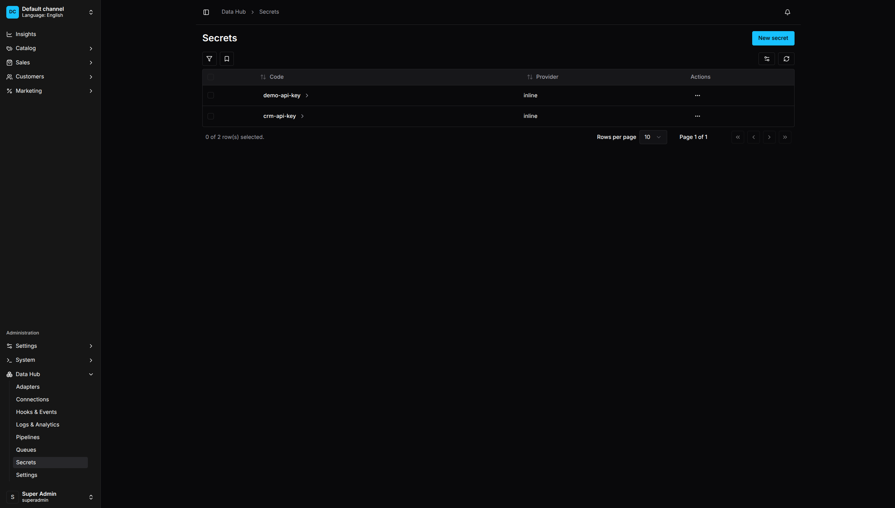
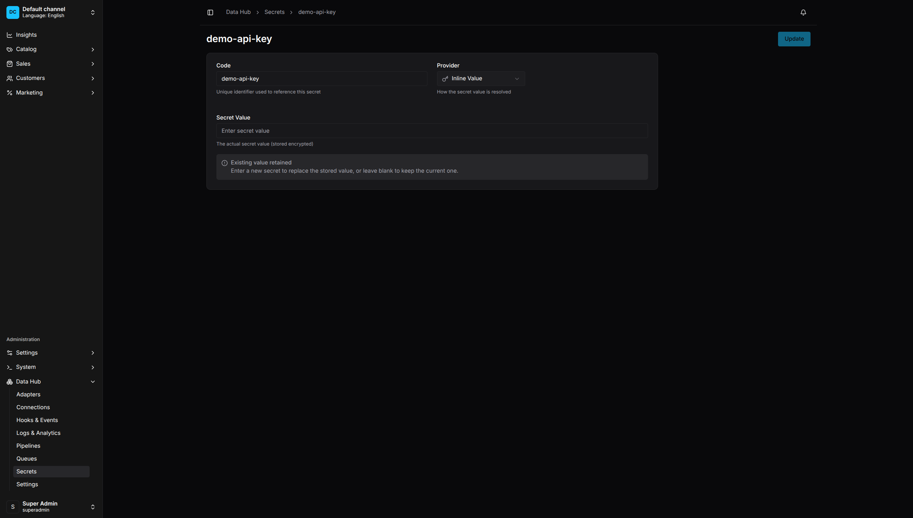

# Secrets Management

Secrets store sensitive values like API keys, passwords, and tokens securely.

<p align="center">
  
  <br>
  <em>Secrets List - Manage API keys, passwords, and tokens</em>
</p>

## Why Use Secrets

- **Security** - Values are encrypted at rest
- **Auditability** - Access is logged
- **No Exposure** - Values never appear in logs or API responses
- **Centralized** - Update credentials in one place

## Creating a Secret

1. Go to **Data Hub > Secrets**
2. Click **Create Secret**
3. Enter:
   - **Code** - Unique identifier
   - **Provider** - How the value is stored
   - **Value** - The secret value or environment variable name
4. Click **Save**

<p align="center">
  
  <br>
  <em>Secret Configuration - Encrypted storage with provider options</em>
</p>

## Secret Providers

### Inline

Store the value directly in the database (encrypted):

```
Code: api-key
Provider: inline
Value: sk_live_abc123...
```

Best for: Development, testing, values that rarely change.

### Environment Variable

Read the value from an environment variable:

```
Code: api-key
Provider: env
Value: SUPPLIER_API_KEY
```

The `Value` field contains the environment variable name, not the actual secret. The value is read at runtime.

Best for: Production, CI/CD pipelines, Docker deployments.

## Using Secrets in Pipelines

Reference secrets by code in step configurations.

### HTTP API Authentication

Bearer token:
```typescript
.extract('api-call', {
    adapterCode: 'httpApi',
    url: 'https://api.example.com/products',
    bearerTokenSecretCode: 'api-key',
})
```

Basic auth:
```typescript
.extract('api-call', {
    adapterCode: 'httpApi',
    url: 'https://api.example.com/products',
    basicAuthSecretCode: 'api-credentials',  // Format: username:password
})
```

API key header:
```typescript
.extract('api-call', {
    adapterCode: 'httpApi',
    url: 'https://api.example.com/products',
    apiKeySecretCode: 'api-key',
    apiKeyHeader: 'X-API-Key',
})
```

### Database Passwords

```typescript
// In connection configuration
{
    code: 'erp-db',
    type: 'postgres',
    settings: {
        host: 'db.example.com',
        database: 'erp',
        username: 'vendure',
        passwordSecretCode: 'erp-db-password',
    },
}
```

### S3 Credentials

```typescript
{
    code: 'aws-storage',
    type: 's3',
    settings: {
        region: 'us-east-1',
        accessKeyIdSecretCode: 'aws-access-key',
        secretAccessKeySecretCode: 'aws-secret-key',
    },
}
```

### SFTP Passwords and Keys

```typescript
{
    code: 'supplier-ftp',
    type: 'sftp',
    settings: {
        host: 'ftp.supplier.com',
        username: 'vendure',
        passwordSecretCode: 'sftp-password',
        // Or for key-based auth:
        privateKeySecretCode: 'sftp-private-key',
    },
}
```

## Viewing Secrets

1. Go to **Data Hub > Secrets**
2. The list shows secret codes and providers
3. Values are never displayed

## Editing Secrets

1. Click on a secret
2. Update the provider or value
3. Click **Save**

Note: You cannot view the existing value when editing.

## Deleting Secrets

1. Click the menu (⋮) on a secret
2. Select **Delete**
3. Confirm deletion

Warning: Deleting a secret will break any pipelines or connections using it.

## Secret Rotation

To rotate a secret:

1. Create a new secret with the new value
2. Update pipelines/connections to use the new secret code
3. Test the updated configuration
4. Delete the old secret

Or, update the secret value directly:

1. Edit the secret
2. Enter the new value
3. Save

All pipelines using that secret will use the new value immediately.

## Code-First Secrets

Define secrets in your Vendure config:

```typescript
DataHubPlugin.init({
    secrets: [
        // From environment variable
        { code: 'api-key', provider: 'env', value: 'SUPPLIER_API_KEY' },

        // Inline value (not recommended for production)
        { code: 'test-key', provider: 'inline', value: 'test-value' },
    ],
})
```

Code-first secrets:
- Are synced to the database on startup
- Take precedence over UI-created secrets with the same code
- Appear as read-only in the UI

## Security Best Practices

### Use Environment Variables in Production

```typescript
{ code: 'api-key', provider: 'env', value: 'API_KEY' }
```

This keeps secrets out of your codebase and allows different values per environment.

### Principle of Least Privilege

- Use separate secrets for different systems
- Create read-only API keys when possible
- Use scoped tokens with minimum required permissions

### Regular Rotation

- Rotate secrets periodically
- Rotate immediately if compromised
- Use the rotation workflow above

### Audit Access

- Review who has `ReadDataHubSecret` permission
- Monitor secret access in logs
- Limit secret management to administrators

### Never Log Secrets

The plugin is designed to never log secret values. If you're extending the plugin, maintain this practice.
