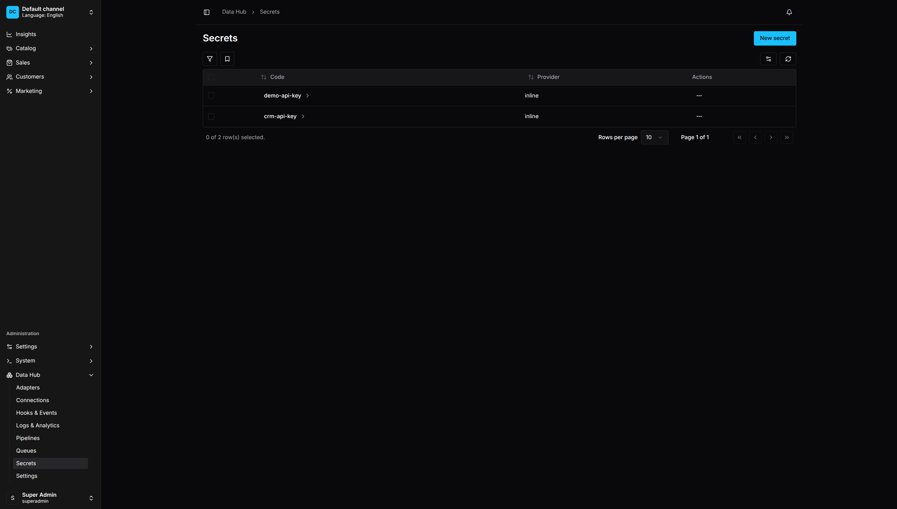
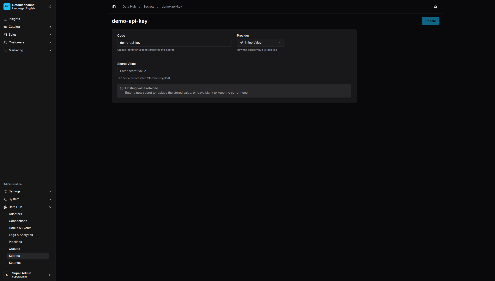

# Secrets Management

Secrets store sensitive values like API keys, passwords, and tokens securely.

<p align="center">
  
  <br>
  <em>Secrets List - Manage API keys, passwords, and tokens</em>
</p>

## Why Use Secrets

- **Controlled storage** - Database-backed inline values are encrypted at rest with AES-256-GCM
- **Restricted management** - Vendure permissions control who can create, read metadata, update, and delete secrets
- **No API disclosure** - Admin API responses expose only whether a value exists, never the stored value
- **Centralized** - Update credentials in one place

> **Important:** Inline storage and resolution are disabled by default unless `DATAHUB_MASTER_KEY` contains at least 32 characters. Keep the same key available to every API server and worker that resolves inline secrets.

ENV secrets do not need a master key. Their stored value must be exactly one environment-variable name matching ^[A-Z][A-Z0-9_]*$; fallback expressions such as API_KEY|development-key are rejected. A valid reference does not prove that the variable exists, so configure it on every API server and worker that can execute a consuming pipeline.

## Creating a Secret

1. Go to **Data Hub > Secrets**
2. Click **Create Secret**
3. Enter:
   - **Code** - Unique identifier
   - **Provider** - How the value is stored
   - **Value** - The secret value or environment variable name
4. Click **Save**

<p align="center">
  
  <br>
  <em>Secret Configuration - Encrypted storage with provider options</em>
</p>

## Secret Providers

### Inline

Store the value in the database encrypted with AES-256-GCM. A valid `DATAHUB_MASTER_KEY` is required before an inline value can be created, updated, or resolved:

```
Code: api-key
Provider: inline
Value: sk_live_abc123...
```

Best for: Values that must be managed in the dashboard and can share a securely managed master key across all application processes.

### Environment Variable

Read the value from an environment variable:

```
Code: api-key
Provider: env
Value: SUPPLIER_API_KEY
```

The `Value` field contains the environment variable name, not the actual secret. The value is read at runtime.

Best for: Production, CI/CD pipelines, Docker deployments.

## Using Secrets in Pipelines

Reference secrets by code in step configurations.

### HTTP API Authentication

Bearer token:
```typescript
.extract('api-call', {
    adapterCode: 'httpApi',
    connectionCode: 'supplier-api',
    url: '/products',
    auth: {
        type: 'BEARER',
        secretCode: 'api-key',
    },
})
```

Basic auth:
```typescript
.extract('api-call', {
    adapterCode: 'httpApi',
    connectionCode: 'supplier-api',
    url: '/products',
    auth: {
        type: 'BASIC',
        usernameSecretCode: 'api-username',
        secretCode: 'api-password',
    },
})
```

API key header:
```typescript
.extract('api-call', {
    adapterCode: 'httpApi',
    connectionCode: 'supplier-api',
    url: '/products',
    auth: {
        type: 'API_KEY',
        secretCode: 'api-key',
        headerName: 'X-API-Key',
    },
})
```

All secret-backed HTTP authentication requires `connectionCode`, and the saved
connection must define a base URL. A relative `url` resolves against that base
URL. An absolute `url` must use its exact origin, and credentials are not
forwarded across cross-origin redirects.

### Database Passwords

```typescript
// In connection configuration
{
    code: 'erp-db',
    type: 'postgres',
    settings: {
        host: 'db.example.com',
        database: 'erp',
        username: 'vendure',
        passwordSecretCode: 'erp-db-password',
    },
}
```

### S3 Credentials

```typescript
{
    code: 'aws-storage',
    type: 's3',
    settings: {
        region: 'us-east-1',
        accessKeyIdSecretCode: 'aws-access-key',
        secretAccessKeySecretCode: 'aws-secret-key',
    },
}
```

### SFTP Passwords and Keys

```typescript
{
    code: 'supplier-ftp',
    type: 'sftp',
    settings: {
        host: 'ftp.supplier.com',
        username: 'vendure',
        passwordSecretCode: 'sftp-password',
        // Or for key-based auth:
        privateKeySecretCode: 'sftp-private-key',
        hostKeyFingerprintSecretCode: 'sftp-host-key',
    },
}
```


`hostKeyFingerprintSecretCode` must reference the trusted SFTP server host key in OpenSSH `SHA256:<base64>` format. It is required in production and is checked during the SSH handshake, before authentication or file access.

## Viewing Secrets

1. Go to **Data Hub > Secrets**
2. The list shows the code, provider, stored-value status, and active runtime source
3. Values are never displayed

Stored-value statuses are:

- **Encrypted** - a database INLINE value has the encrypted envelope expected by the current implementation
- **Environment reference** - the database stores an environment-variable name; this does not prove that every process has that variable
- **Unencrypted** - a database INLINE value is not encrypted and runtime resolution rejects it
- **Missing value** - no stored reference or inline value exists

**Code-first active** means runtime resolution uses the in-memory definition and the displayed database row is inactive.
## Editing Secrets

1. Click on a secret
2. Choose one value action:
   - Leave the value field blank to retain the current stored value or environment-variable reference
   - Enter a non-blank value to replace it
   - Select **Clear stored value**, confirm, and then click **Update** to remove it explicitly
3. Click **Update**

Changing the provider requires a new non-blank value. For `ENV`, the value must be an environment-variable name such as `SUPPLIER_API_KEY`.

The current value is never returned to the browser. The form only knows whether a value exists.

## Deleting Secrets

1. Click the menu (⋮) on a database secret
2. Select **Delete**
3. Confirm deletion

Deletion is blocked when the secret is referenced by a published pipeline, a
nonterminal run snapshot, saved connection, or managed destination. Renaming is
blocked by the same references. The mutation returns `NOT_DELETED` with the
blocking reference in its message. For a row marked **Code-first
active**, deleting an unreferenced row removes only the inactive database
fallback; the in-memory definition remains active.

## Secret Rotation

To rotate a secret:

1. Create a new secret with the new value
2. Update pipelines/connections to use the new secret code
3. Test the updated configuration
4. Delete the old secret

Or, update the secret value directly:

1. Edit the secret
2. Enter the new value
3. Save

All pipelines using that secret will use the new value immediately.

## Master Key Rotation and Recovery

DATAHUB_MASTER_KEY is not stored by the plugin. Every API server and worker that resolves database INLINE secrets must use the same durable key.

To rotate the key safely:

1. Back up the database and inventory every INLINE secret code and its authoritative plaintext outside the plugin.
2. Stop pipeline execution and all processes that may resolve secrets; do not run old-key and new-key processes together.
3. Start a maintenance instance with the new key.
4. Re-enter a known replacement value for every database INLINE secret so each row is encrypted with the new key.
5. Verify representative connections and pipelines, then start every API server and worker with the new key.

The Admin API never returns secret values, so the plugin cannot export or automatically re-encrypt unknown plaintext. If the old key is lost or an encrypted row was created with a different key, recover the value from its external authority and replace it. Otherwise clear or delete the unusable row. ENV references are unaffected by master-key rotation.

## Code-First Secrets

Define secrets in your Vendure config:

```typescript
DataHubPlugin.init({
    secrets: [
        // From environment variable
        { code: 'api-key', provider: 'ENV', value: 'SUPPLIER_API_KEY' },

        // Another environment-backed secret
        { code: 'test-key', provider: 'ENV', value: 'TEST_KEY' },
    ],
})
```

Code-first secrets:

- Stay in the plugin's in-memory registry and are never persisted by configuration sync
- Load before secret-consuming services start
- Are validated as one complete snapshot; an invalid configured file aborts startup without publishing a partial registry
- Merge external-file definitions first and inline plugin options second, so inline plugin secret options win on cross-source code collisions
- Reject duplicate codes within either source
- Take precedence during runtime resolution over a database secret with the same code
- Reject database create or rename operations that would collide with an active code-first code
- Must be changed in configuration and deployed again
- Require ENV values to contain exactly one environment-variable name

Code-first INLINE values are never encrypted in TypeScript, JSON, or YAML source. They are rejected in production even when DATAHUB_MASTER_KEY is configured. In non-production they require a valid master key, but the source file still contains plaintext. Use ENV for deployed code-first secrets.

A same-code database row can remain from an older release. The UI marks it as inactive while the code-first definition is active. Removing the code-first definition makes normal database fallback possible on the next startup, so review and delete or deliberately migrate the inactive row before removing the authoritative code-first secret.
## Security Best Practices

### Use Environment Variables in Production

```typescript
{ code: 'api-key', provider: 'ENV', value: 'API_KEY' }
```

This keeps secrets out of your codebase and allows different values per environment.

### Principle of Least Privilege

- Use separate secrets for different systems
- Create read-only API keys when possible
- Use scoped tokens with minimum required permissions

### Regular Rotation

- Rotate secrets periodically
- Rotate immediately if compromised
- Use the rotation workflow above

### Audit Access

- Review who has `ReadDataHubSecret` permission
- Monitor secret access in logs
- Limit secret management to administrators

### Never Log Secrets

The plugin is designed to never log secret values. If you're extending the plugin, maintain this practice.
